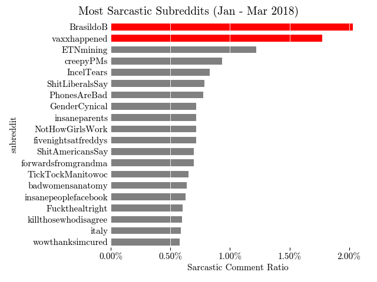
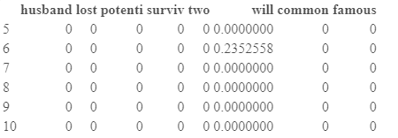
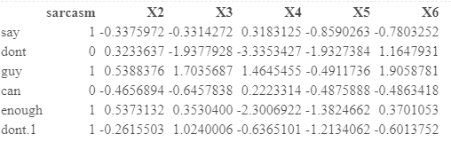
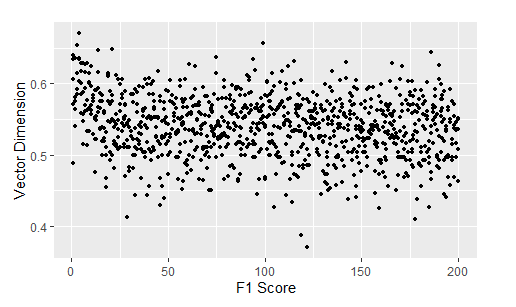

```{r setup, include=FALSE}
library(tidyverse)
library(lme4)
knitr::opts_chunk$set(echo = FALSE,cache = TRUE, message = FALSE)
knitr::opts_knit$set(kable.force.latex=TRUE)
knitr::knit_hooks$set(plot = function(x, options)  {
  paste0(knitr::hook_plot_tex(x, options), "\n\\FloatBarrier\n")
})
```

```{r Libraries, include=FALSE}
# Loading libraries
library(kableExtra)
library(conflicted)
library(tm)
library(MLmetrics)
library(glmnet)
library(qdapRegex)
library(car)
library(plm)
library(reshape2)
library(tidyverse)
library(glmnet)
library(ggplot2)
library(uchardet)
library(word2vec)
library(text2vec)
library(regclass)
conflicts_prefer(MLmetrics::Recall)
```

\newpage

<!--------------------------------------------------------------TFIDF CODE-------------------------------------------------------------------->

```{r Loading in data}
# Load in data
data <- read.csv("../data/NHGW.csv")
data <- data[,2:3]
```

```{r Create Corpus}
y <- data$Sarcastic
doc_id <- 1:nrow(data)
data$doc_id <- doc_id
data_clean <- data[,c("Body","doc_id")]
colnames(data_clean)[1] <- "text"
data_clean$text <- rm_non_words(data_clean$text)

# Construct Corpus
ds <- DataframeSource(data_clean)
corpus <- Corpus(ds)
```

```{r Clean Corpus}
# Clean the Corpus
# Remove punctuation
corpus <- tm_map(corpus, content_transformer(removePunctuation))
# Send everything to lower case
corpus <- tm_map(corpus, content_transformer(tolower))
# Remove stopwords
corpus <- tm_map(corpus, content_transformer(removeWords), 
          stopwords("english"))
# Remove whitespace
corpus <- tm_map(corpus, stripWhitespace)
# Remove numbers
corpus <- tm_map(corpus, content_transformer(removeNumbers))
# Stemming
corpus <- tm_map(corpus, stemDocument)
```

```{r Create TF-IDF DTM}
# Create DTM object
dtm <- DocumentTermMatrix(corpus)
# Weight TF-IDF
tfidf_dtm <- weightTfIdf(dtm)
```

```{r Creating Quantile List}
# Set seed
set.seed(874)

# Do 80/20 train/test split
train_idx <- sample(1:nrow(data),floor(.8*(nrow(data))))
test_idx <- setdiff(1:nrow(data),train_idx)

# Get quantiles
tfidf_mat <- as.matrix(tfidf_dtm[train_idx,])

tfidf_vec <- as.vector(tfidf_mat)

tfidf_vec <- tfidf_vec[tfidf_vec > 0]

quants <- quantile(tfidf_vec, probs = seq(0.05,0.95,0.05))

# Only keep quantiles that result in matrices with fewer columns than rows
 # cols <- c()
 # for (quant in quants) {
 #   cols <- c(cols, ncol(tfidf_dtm[train_idx,tfidf_dtm$v > quant]))
 # }
 # 
 #  numRows <- nrow(tfidf_dtm[train_idx,])
 #  quants <- quants[which(cols < numRows)]
```

```{r Perform Best Subset Regression, cache=TRUE, message=FALSE,warning=FALSE}
# Get AICs for different subsets
models_aic <- list()
for (quant in quants) {
  # Filter DTM
  tfidf_dtm_r <- tfidf_dtm[train_idx, tfidf_dtm$v > quant]

  # Construct dataframe for fitting
  x <- as.data.frame(as.matrix(tfidf_dtm_r))
  y_train <- y[train_idx]
  data <- cbind(y_train, x)

  # Fit model
  glm.out <- glm(y_train ~ ., family = binomial, data)
  models_aic <- append(models_aic, glm.out$aic)
}

# Get best quantitle threshold by AIC
thresh <- quants[which.min(models_aic)]
```

```{r Fit 95th Percentile Mode, warning=FALSE}
# Filter DTM
tfidf_dtm_r <- tfidf_dtm[train_idx,tfidf_dtm$v > thresh  ]


# Construct dataframe for fitting
x <- as.data.frame(as.matrix(tfidf_dtm_r))
y_train <- y[train_idx]
data <- cbind(y_train,x)
basemodelforcormap <- data

# Fit model
glm.out <- glm(y_train~., family = binomial, data)

# Percent reduction in deviance
per_dev_red_base <- 1 - glm.out$deviance/glm.out$null.deviance
```

```{r Train Metrics for Base}
# Get predictions
predict.out <- predict(glm.out, type = "response")
predict.out[which(predict.out >= 0.5)] <- 1
predict.out[which(predict.out < 0.5)] <- 0
guess <- data.frame(predict.out)

# Format output
output <- cbind(guess, y[train_idx])
colnames(output)[2] <- "truth"
y_true <- output$truth
y_pred <- output$predict.out

# Get metrics
Re_base_train <- Recall(y_true, y_pred, positive = 1)
Pr_base_train <- Precision(y_true, y_pred, positive = 1)
F1_base_train <- F1_Score(y_true, y_pred, positive = 1)
```

```{r Test Metrics for Base, warning=FALSE}
# Get predictions
test_data <- cbind(as.data.frame(as.matrix(tfidf_dtm[test_idx,])))
predict.out <- predict(glm.out, newdata = test_data ,type="response")
predict.out[which(predict.out >= 0.5)] <- 1
predict.out[which(predict.out < 0.5)] <- 0
guess <- data.frame(predict.out)

# Format output
output <- cbind(guess,y[test_idx])
colnames(output)[2] <- "truth"
y_true <- output$truth
y_pred <- output$predict.out

# Get metrics
Re_base_test <- Recall(y_true, y_pred, positive = 1)
Pr_base_test <- Precision(y_true, y_pred, positive = 1)
F1_base_test <- F1_Score(y_true, y_pred, positive = 1)
```

```{r VIFs Base Model, warning=FALSE}
# Cannot use VIF if there are NAs, remove them
dropterms <-
  names(glm.out$coefficients[is.na(glm.out$coefficients)])
x <- x[, which(!(colnames(x) %in% dropterms))]
data <- cbind(y_train, x)
glm.out <- glm(y_train ~ ., family = binomial, data)

# 6 VIFs over 10 serious collinearity problems
VIFs_base <- vif(glm.out) 
```

```{r Perform PCA, warning=FALSE}
pca.out <- prcomp(as.data.frame(as.matrix(tfidf_dtm_r)))
pca.out.test <- predict(pca.out, as.data.frame(as.matrix(tfidf_dtm[test_idx,])))

# 90th cumulative proportion is given by PC1:PC24
pcs <- as.data.frame(pca.out$x[,1:24])
train_data <- cbind(y_train,pcs)
test_data <- as.data.frame(pca.out.test[,1:24])

# Fit model
glm.out <- glm(y_train~., family = binomial, train_data)

# Percent reduction in deviance
per_dev_red_PCA <- glm.out$deviance/glm.out$null.deviance # note this is actually an increase by a factor of 24.03453
```

```{r Train Metrics for PCA}
# Get predictions
predict.out <- predict(glm.out, type = "response")
predict.out[which(predict.out >= 0.5)] <- 1
predict.out[which(predict.out < 0.5)] <- 0
guess <- data.frame(predict.out)

# Format output
output <- cbind(guess, y[train_idx])
colnames(output)[2] <- "truth"
y_true <- output$truth
y_pred <- output$predict.out

# Get metrics
Re_PCA_train <- Recall(y_true, y_pred, positive = 1)
Pr_PCA_train <- Precision(y_true, y_pred, positive = 1)
F1_PCA_train <- F1_Score(y_true, y_pred, positive = 1)
```

```{r Test Metrics for PCA, warning=FALSE}
# Get predictions
predict.out <- predict(glm.out, newdata = test_data ,type="response")
predict.out[which(predict.out >= 0.5)] <- 1
predict.out[which(predict.out < 0.5)] <- 0
guess <- data.frame(predict.out)

# Format output
output <- cbind(guess,y[test_idx])
colnames(output)[2] <- "truth"
y_true <- output$truth
y_pred <- output$predict.out

# Get metrics
Re_PCA_test <- Recall(y_true, y_pred, positive = 1)
Pr_PCA_test <- Precision(y_true, y_pred, positive = 1)
F1_PCA_test <- F1_Score(y_true, y_pred, positive = 1)
```

```{r VIFs PCA Model, warning=FALSE}
# All 1
VIFs_PCA <- vif(glm.out) 
```

```{r Fit LASSO}
# Construct dataframe for fitting
x <- as.data.frame(as.matrix(tfidf_dtm[train_idx,]))
y_train <- y[train_idx]
data <- cbind(y_train,x)
test_data <- cbind(as.data.frame(as.matrix(tfidf_dtm[test_idx,])))

# Perform CV
glmnet.cv.out <- cv.glmnet(as.matrix(x),y_train,family="binomial",alpha = 1)
best_lambda <- glmnet.cv.out$lambda.min

# Fit best found model
glmnet.out <- glmnet(as.matrix(x),y_train,family="binomial",alpha = 1,lambda = best_lambda)
```

```{r Train Metrics for LASSO, warning=FALSE}
# Get predictions
predict.out <- predict(glmnet.out, as.matrix(x),type = "response")
predict.out[which(predict.out >= 0.5)] <- 1
predict.out[which(predict.out < 0.5)] <- 0
guess <- data.frame(predict.out)

# Format output
output <- cbind(guess, y[train_idx])
colnames(output)[2] <- "truth"
y_true <- output$truth
y_pred <- output$s0

# Get metrics
Re_LASSO_train <- Recall(y_true, y_pred, positive = 1)
Pr_LASSO_train <- Precision(y_true, y_pred, positive = 1)
F1_LASSO_train <- F1_Score(y_true, y_pred, positive = 1)
```

```{r Test Metrics for LASSO, warning=FALSE}
# Get predictions
test_data <- as.matrix(tfidf_dtm[test_idx,rownames(glmnet.out$beta)])
predict.out <- predict(glmnet.out,newx = test_data,type="response")
predict.out[which(predict.out >= 0.5)] <- 1
predict.out[which(predict.out < 0.5)] <- 0
guess <- data.frame(predict.out)

# Format output
output <- cbind(guess, y[test_idx])
colnames(output)[2] <- "truth"
y_true <- output$truth
y_pred <- output$s0

# Get metrics
Re_LASSO_test <- Recall(y_true, y_pred, positive = 1)
Pr_LASSO_test <- Precision(y_true, y_pred, positive = 1)
F1_LASSO_test <- F1_Score(y_true, y_pred, positive = 1)
```

```{r Get results for weighted base model, warning=FALSE}
# Recreate DTM
tfidf_dtm_r <- tfidf_dtm[train_idx, tfidf_dtm$v > thresh]

# Construct dataframe for fitting
x <- as.data.frame(as.matrix(tfidf_dtm_r))
y_train <- y[train_idx]
data <- cbind(y_train, x)
test_data <- cbind(as.data.frame(as.matrix(tfidf_dtm[test_idx, ])))
results_base_weighted <-
  data.frame(Recall = NA,
             Precision = NA,
             F1.Score = NA,
             w1 = NA)

# For each weight calculate metrics
for (w1 in seq(0, 1, 0.01)) {
  weights <- c()
  # w1 = 0.01
  w2 = 1 - w1
  
  for (i in 1:length(y_train)) {
    if (y_train[i] == 1) {
      weights <- c(weights, w1)
    } else{
      weights <- c(weights, w2)
    }
  }
  
  # Fit model
  glm.out <-
    glm(y_train ~ .,
        family = binomial,
        data = data,
        weights = weights)
  
  # Get results
  predict.out <-
    predict(glm.out, newdata = test_data , type = "response")
  predict.out[which(predict.out >= 0.5)] <- 1
  predict.out[which(predict.out < 0.5)] <- 0
  guess <- data.frame(predict.out)
  output <- cbind(guess, y[test_idx])
  colnames(output)[2] <- "truth"
  y_true <- output$truth
  y_pred <- output$predict.out
  
  # Get metrics
  Re <- Recall(y_true, y_pred, positive = 1)
  Pr <- Precision(y_true, y_pred, positive = 1)
  F1 <- F1_Score(y_true, y_pred, positive = 1)
  
  results_base_weighted <-
    rbind(results_base_weighted, data.frame(
      Recall = Re,
      Precision = Pr,
      F1.Score = F1,
      w1 = w1
    ))
}
results_base_weighted <- na.omit(results_base_weighted)
```

```{r Visualize results_base_weighted}
# Reshape data 
results_long <- melt(results_base_weighted, id.vars = "w1", 
                     variable.name = "Test Metrics", value.name = "value")
# Visualize
results_base_weighted_p <- ggplot(results_long, aes(x = w1, y = value, color =`Test Metrics` )) +
  geom_point()+ ggtitle("Base Model Test Metrics vs Weighting") +
  xlab("Weighting") + ylab("Test Metric") + theme(plot.title = element_text(hjust = 0.5))
```

```{r Fit optimal base weighting, warning=FALSE}
# Fit model
w1 = 0.75
w2 = 1 - w1
weights <- c()

for (i in 1:length(y_train)) {
  if (y_train[i] == 1) {
    weights <- c(weights, w1)
  } else{
    weights <- c(weights, w2)
  }
}

# Fit model
glm.out <-
  glm(y_train ~ .,
      family = binomial,
      data = data,
      weights = weights)

# Percent reduction in deviance
per_dev_red_base_weighted <- 1 - glm.out$deviance/glm.out$null.deviance
```

```{r Train Metrics for Base Weighted, warning=FALSE}
# Get predictions
predict.out <-
  predict(glm.out, newdata = data , type = "response")
predict.out[which(predict.out >= 0.5)] <- 1
predict.out[which(predict.out < 0.5)] <- 0
guess <- data.frame(predict.out)

# Format output
output <- cbind(guess, y[train_idx])
colnames(output)[2] <- "truth"
y_true <- output$truth
y_pred <- output$predict.out

# Get metrics
Re_base_weighted_train <- Recall(y_true, y_pred, positive = 1)
Pr_base_weighted_train <- Precision(y_true, y_pred, positive = 1)
F1_base_weighted_train <- F1_Score(y_true, y_pred, positive = 1)
```

```{r Test Metrics for Base Weighted, warning=FALSE}
# Get predictions
test_data <- cbind(as.data.frame(as.matrix(tfidf_dtm[test_idx, ])))
predict.out <-
  predict(glm.out, newdata = test_data , type = "response")
predict.out[which(predict.out >= 0.5)] <- 1
predict.out[which(predict.out < 0.5)] <- 0
guess <- data.frame(predict.out)

# Format output
output <- cbind(guess, y[test_idx])
colnames(output)[2] <- "truth"
y_true <- output$truth
y_pred <- output$predict.out

# Get metrics
Re_base_weighted_test <- Recall(y_true, y_pred, positive = 1)
Pr_base_weighted_test <- Precision(y_true, y_pred, positive = 1)
F1_base_weighted_test <- F1_Score(y_true, y_pred, positive = 1)
```

```{r VIFs Base Weighted Model, warning=FALSE}
# Cannot use VIF if there are NAs, remove them
dropterms <-
  names(glm.out$coefficients[is.na(glm.out$coefficients)])
x <- x[, which(!(colnames(x) %in% dropterms))]
data <- cbind(y_train, x)
glm.out <- glm(y_train ~ ., family = binomial, data)

# 5 VIFs over 10
VIFs_weighted_base <- vif(glm.out) 
```

```{r Get results for weighted PCA model, warning=FALSE}
# Recreate DTM
tfidf_dtm_r <- tfidf_dtm[train_idx, tfidf_dtm$v > thresh]

pca.out <- prcomp(as.data.frame(as.matrix(tfidf_dtm_r)))
pca.out.test <- predict(pca.out, as.data.frame(as.matrix(tfidf_dtm[test_idx,])))

# 90th cumulative proportion is given by PC1:PC24
pcs <- as.data.frame(pca.out$x[,1:24])
train_data <- cbind(y_train,pcs)
test_data <- as.data.frame(pca.out.test[,1:24])

# Create results dataframe
results_weighted_pca <-
  data.frame(Recall = NA,
             Precision = NA,
             F1.Score = NA,
             w1 = NA)

# For each weight calculate metrics
for (w1 in seq(0, 1, 0.01)) {
  weights <- c()
  # w1 = 0.01
  w2 = 1 - w1
  
  for (i in 1:length(y_train)) {
    if (y_train[i] == 1) {
      weights <- c(weights, w1)
    } else{
      weights <- c(weights, w2)
    }
  }
  
  # Fit model
  glm.out <-
    glm(y_train ~ .,
        family = binomial,
        data = train_data,
        weights = weights)
  
  # Get results
  predict.out <-
    predict(glm.out, newdata = test_data , type = "response")
  predict.out[which(predict.out >= 0.5)] <- 1
  predict.out[which(predict.out < 0.5)] <- 0
  guess <- data.frame(predict.out)
  output <- cbind(guess, y[test_idx])
  colnames(output)[2] <- "truth"
  y_true <- output$truth
  y_pred <- output$predict.out
  
  # Get metrics
  Re <- Recall(y_true, y_pred, positive = 1)
  Pr <- Precision(y_true, y_pred, positive = 1)
  F1 <- F1_Score(y_true, y_pred, positive = 1)
  
  results_weighted_pca <-
    rbind(results_weighted_pca, data.frame(
      Recall = Re,
      Precision = Pr,
      F1.Score = F1,
      w1 = w1
    ))
}
results_weighted_pca <- na.omit(results_weighted_pca)
```

```{r Visualize results_PCA_weighted}
# Reshape data 
results_long <- melt(results_weighted_pca, id.vars = "w1", 
                     variable.name = "Test Metrics", value.name = "value")

# Visualize
results_PCA_weighted_p <- ggplot(results_long, aes(x = w1, y = value, color =`Test Metrics`)) +
  geom_point() + ggtitle("PCA Model Test Metrics vs Weighting") +
  xlab("Weighting") + ylab("Test Metric") + theme(plot.title = element_text(hjust = 0.5))
```

```{r Fit optimal PCA weighting, warning=FALSE}
# Fit model
w1 = 0.62
w2 = 1 - w1
weights <- c()

for (i in 1:length(y_train)) {
  if (y_train[i] == 1) {
    weights <- c(weights, w1)
  } else{
    weights <- c(weights, w2)
  }
}

# Fit model
glm.out <-
  glm(y_train ~ .,
      family = binomial,
      data = train_data,
      weights = weights)

# Percent reduction in deviance
per_dev_red_PCA <- glm.out$deviance/glm.out$null.deviance # note this is actually an increase by a factor of 19.96864
```

```{r Train Metrics for Weighted PCA}
# Get predictions
predict.out <- predict(glm.out, type = "response")
predict.out[which(predict.out >= 0.5)] <- 1
predict.out[which(predict.out < 0.5)] <- 0
guess <- data.frame(predict.out)

# Format output
output <- cbind(guess, y[train_idx])
colnames(output)[2] <- "truth"
y_true <- output$truth
y_pred <- output$predict.out

# Get metrics
Re_weighted_PCA_train <- Recall(y_true, y_pred, positive = 1)
Pr_weighted_PCA_train <- Precision(y_true, y_pred, positive = 1)
F1_weighted_PCA_train <- F1_Score(y_true, y_pred, positive = 1)
```

```{r Test Metrics for Weighted PCA, warning=FALSE}
# Get predictions
predict.out <- predict(glm.out, newdata = test_data ,type="response")
predict.out[which(predict.out >= 0.5)] <- 1
predict.out[which(predict.out < 0.5)] <- 0
guess <- data.frame(predict.out)

# Format output
output <- cbind(guess,y[test_idx])
colnames(output)[2] <- "truth"
y_true <- output$truth
y_pred <- output$predict.out

# Get metrics
Re_weighted_PCA_test <- Recall(y_true, y_pred, positive = 1)
Pr_weighted_PCA_test <- Precision(y_true, y_pred, positive = 1)
F1_weighted_PCA_test <- F1_Score(y_true, y_pred, positive = 1)
```

```{r VIFs Weighted PCA Model, warning=FALSE}
# All 1
VIFs_weighted_PCA <- vif(glm.out) # none over 10
```

```{r refit best LASSO}
# Construct dataframe for fitting
x <- as.data.frame(as.matrix(tfidf_dtm[train_idx,]))
y_train <- y[train_idx]
data <- cbind(y_train,x)
test_data <- cbind(as.data.frame(as.matrix(tfidf_dtm[test_idx,])))

# Fit best found model
glmnet.out <- glmnet(as.matrix(x),y_train,family="binomial",alpha = 1,lambda = best_lambda)
```

```{r Get results for weighted LASSO model, warning=FALSE}
# Construct dataframe for fitting
x <- as.data.frame(as.matrix(tfidf_dtm[train_idx, ]))
y_train <- y[train_idx]
data <- cbind(y_train, x)
test_data <- as.matrix(tfidf_dtm[test_idx, ])

# Create results dataframe
results_weighted_lasso <-
  data.frame(Recall = NA,
             Precision = NA,
             `F1 Score` = NA,
             w1 = NA)

# For each weight calculate metrics
for (w1 in seq(0.01, 0.99, 0.01)) {
  weights <- c()
  # w1 = 0.1
  w2 = 1 - w1
  
  for (i in 1:length(y_train)) {
    if (y_train[i] == 1) {
      weights <- c(weights, w1)
    } else{
      weights <- c(weights, w2)
    }
  }
  
  # Fit model
  glmnet.out <-
    glmnet(
      as.matrix(x),
      y_train,
      family = "binomial",
      alpha = 1,
      lambda = best_lambda,
      weights = weights
    )
  
  # Get results
  predict.out <-
    predict(glmnet.out, newx = test_data , type = "response")
  predict.out[which(predict.out >= 0.5)] <- 1
  predict.out[which(predict.out < 0.5)] <- 0
  guess <- data.frame(predict.out)
  output <- cbind(guess, y[test_idx])
  colnames(output)[2] <- "truth"
  y_true <- output$truth
  y_pred <- output$s0
  
  # Get metrics
  Re <- Recall(y_true, y_pred, positive = 1)
  Pr <- Precision(y_true, y_pred, positive = 1)
  F1 <- F1_Score(y_true, y_pred, positive = 1)
  
  results_weighted_lasso <-
    rbind(results_weighted_lasso, data.frame(
      Recall = Re,
      Precision = Pr,
      F1.Score = F1,
      w1 = w1
    ))
}
results_weighted_lasso <- na.omit(results_weighted_lasso)
```

```{r Visualize results_weighted_lasso}
# Reshape data 
results_long <- melt(results_weighted_lasso, id.vars = "w1", 
                    variable.name = "Test Metrics", value.name = "value")

# Visualize
results_weighted_lasso_p <- ggplot(results_long, aes(x = w1, y = value, color =`Test Metrics`)) +
  geom_point() + ggtitle("LASSO Model Test Metrics vs Weighting") +
  xlab("Weighting") + ylab("Test Metric") + theme(plot.title = element_text(hjust = 0.5))
```

```{r Fit optimal LASSO weighting, warning=FALSE}
# Fit model
w1 = 0.55
w2 = 1 - w1
weights <- c()

for (i in 1:length(y_train)) {
  if (y_train[i] == 1) {
    weights <- c(weights, w1)
  } else{
    weights <- c(weights, w2)
  }
}

 # Fit model
  glmnet.out <-
    glmnet(
      as.matrix(x),
      y_train,
      family = "binomial",
      alpha = 1,
      lambda = best_lambda,
      weights = weights
    )
  
# Percent reduction in deviance
per_dev_red_weighted_Lasso <- glmnet.out$dev.ratio
```

```{r Train Metrics for Weighted LASSO}
# Get predictions
predict.out <- predict(glmnet.out,newx = as.matrix(x), type = "response")
predict.out[which(predict.out >= 0.5)] <- 1
predict.out[which(predict.out < 0.5)] <- 0
guess <- data.frame(predict.out)

# Format output
output <- cbind(guess, y[train_idx])
colnames(output)[2] <- "truth"
y_true <- output$truth
y_pred <- output$s0

# Get metrics
Re_weighted_LASSO_train <- Recall(y_true, y_pred, positive = 1)
Pr_weighted_LASSO_train <- Precision(y_true, y_pred, positive = 1)
F1_weighted_LASSO_train <- F1_Score(y_true, y_pred, positive = 1)
```

```{r Test Metrics for Weighted LASSO, warning=FALSE}
# Get predictions
predict.out <- predict(glmnet.out, newx = test_data ,type="response")
predict.out[which(predict.out >= 0.5)] <- 1
predict.out[which(predict.out < 0.5)] <- 0
guess <- data.frame(predict.out)

# Format output
output <- cbind(guess,y[test_idx])
colnames(output)[2] <- "truth"
y_true <- output$truth
y_pred <- output$s0

# Get metrics
Re_weighted_LASSO_test <- Recall(y_true, y_pred, positive = 1)
Pr_weighted_LASSO_test <- Precision(y_true, y_pred, positive = 1)
F1_weighted_LASSO_test <- F1_Score(y_true, y_pred, positive = 1)
```

<!-------------------------------------------------------------------------------------------------------------------------------------------->

<!--------------------------------------------------------------GloVe CODE-------------------------------------------------------------------->

```{r GloVe Loading Data, warning=FALSE}
reddit_data <- read.csv("../data/NHGW.csv",header=T, encoding = "UTF-8")
attach(reddit_data)
```

```{r GloVe Cleaning Data, warning=FALSE}
#removing punctuation
reddit_data$Body = removePunctuation(reddit_data$Body, ucp=TRUE)
#everything lowercase
reddit_data$Body = tolower(reddit_data$Body)
#remove stopwords
reddit_data$Body = removeWords(reddit_data$Body, stopwords("english"))
#strip whitespace
reddit_data$Body = stripWhitespace(reddit_data$Body)
#remove numbers
reddit_data$Body = removeNumbers(reddit_data$Body)
#stemming
reddit_data$Body = stemDocument(reddit_data$Body)
#convert encoding
reddit_data$Body = txt_clean_word2vec(reddit_data$Body)
#remove NA rows
reddit_data = na.omit(reddit_data)
#remove rows with NA encoding
n = nrow(reddit_data)
for(i in 1:n){
  if(is.na(detect_str_enc(reddit_data[i,]$Body))){
    reddit_data <- reddit_data[-c(i),]
  }
}
#any(is.na(detect_str_enc(reddit_data$Body)))
```

```{r GloVe Creating Training/Testing Datasets, warning=FALSE}
# split into training and testing sets
set.seed(874)
N = nrow(reddit_data)                                      
n = round(N*0.8)                               
m = N-n 
tr_ind <- sample(N, n)            
te_ind <- setdiff(seq_len(N), tr_ind)

reddit_train <- reddit_data[tr_ind,]
reddit_test <- reddit_data[te_ind,]
```

```{r GloVe Vector Sum Function, warning=FALSE}
# creating a function to make sentences into vectors
sentence_vec <- function(words){
  sum <- 0
  for(x in 1:nrow(words)){
    if(words[x,1] %in% rownames(word_vectors)){
      sum <- sum + word_vectors[words[x,1], ,drop = FALSE]
    }
  }
  return(sum)
}
```

\newpage

```{r ross told me to put this here}
  # Create iterator over tokens
  tokens <- space_tokenizer(reddit_train$Body)
  # Create vocabulary. Terms will be unigrams (simple words).
  it = itoken(tokens, progressbar = FALSE)
  vocab <- create_vocabulary(it)
  vocab <- prune_vocabulary(vocab, term_count_min = 5L) # wonder which of 3-5 is best
  
  vectorizer <- vocab_vectorizer(vocab)
  # use window of 5 for context words
  tcm <- create_tcm(it, vectorizer, skip_grams_window = 5L)
  
```

```{r GloVe Finding Best Dimension for GloVe Model, warning=FALSE,message=FALSE,results='hide'}

knitr::opts_chunk$set(echo = F,
                      results = "hide")

#create empty aic and dim vectors
f1_vec_glove = c()
dim_vec_glove = c()
reddit_data = na.omit(reddit_data)


#for(i in 1:200){
  #for(x in 1:5){
  # fitting the GLOVE model
  glove = GlobalVectors$new(rank = 150, x_max = 10)
  wv_main = glove$fit_transform(tcm, n_iter = 10, convergence_tol = 0.01, n_threads = 8)
  
  # creating word vectors
  wv_context = glove$components
  word_vectors = wv_main + t(wv_context)

  training_mat <- c()
  for(x in 1:nrow(reddit_train)){
    token <- space_tokenizer(reddit_train$Body[x])
    words = itoken(token, progressbar = FALSE)
    words <- create_vocabulary(words)
    sentenceVec <- sentence_vec(words)
    training_mat <- rbind(training_mat, sentenceVec)
  }

  training_mat <- cbind(reddit_train$Sarcastic, training_mat)
  training_mat <- data.frame(training_mat)
  colnames(training_mat)[1] <- "sarcasm"

  
  # creating testing matrix
  testing_mat <- c()
  for(x in 1:nrow(reddit_test)){
    token <- space_tokenizer(reddit_test$Body[x])
    words <- itoken(token, progressbar = FALSE)
    words <- create_vocabulary(words)
    sentenceVec <- sentence_vec(words)
    testing_mat <- rbind(testing_mat, sentenceVec)
  }
  
  testing_mat <- cbind(reddit_train$Sarcastic, testing_mat)
  testing_mat <- data.frame(testing_mat)
  colnames(testing_mat)[1] <- "sarcasm"

  #fit logsitic regression
  log_reg = glm(sarcasm~., family='binomial', data=training_mat)
  
  #f1 score of test set
  predict.out <- predict(log_reg, newdata=testing_mat, type = "response")
  predict.out[which(predict.out >= 0.5)] <- 1
  predict.out[which(predict.out < 0.5)] <- 0
  guess <- data.frame(predict.out)
  # Format output
  output <- cbind(guess, testing_mat[,1])
  colnames(output)[2] <- "truth"
  y_true <- output$truth
  y_pred <- output$predict.out
  
  # Get metrics
  f1_vec_glove = append(f1_vec_glove, F1_Score(y_true, y_pred, positive = 1))
  dim_vec_glove = append(dim_vec_glove, i)
#}}
```

\newpage

```{r GloVe Create Base Model, warning=FALSE}
glove = GlobalVectors$new(rank = 150, x_max = 10)
wv_main = glove$fit_transform(tcm, n_iter = 10, convergence_tol = 0.01, n_threads = 8)
  
# creating word vectors
wv_context = glove$components
word_vectors = wv_main + t(wv_context)

# creating training matrix
training_mat <- c()
for(x in 1:nrow(reddit_train)){
  token <- space_tokenizer(reddit_train$Body[x])
  words = itoken(token, progressbar = FALSE)
  words <- create_vocabulary(words)
  sentenceVec <- sentence_vec(words)
  training_mat <- rbind(training_mat, sentenceVec)
}

training_mat <- cbind(reddit_train$Sarcastic, training_mat)
training_mat <- data.frame(training_mat)
colnames(training_mat)[1] <- "sarcasm"

# creating testing matrix
testing_mat <- c()
for(x in 1:nrow(reddit_test)){
  token <- space_tokenizer(reddit_test$Body[x])
  words <- itoken(token, progressbar = FALSE)
  words <- create_vocabulary(words)
  sentenceVec <- sentence_vec(words)
  testing_mat <- rbind(testing_mat, sentenceVec)
}

testing_mat <- cbind(reddit_train$Sarcastic, testing_mat)
testing_mat <- data.frame(testing_mat)
colnames(testing_mat)[1] <- "sarcasm"


#fit logsitic regression
log_reg = glm(sarcasm~., family='binomial', data=training_mat)
#summary(log_reg)
```

```{r GloVe Train Metrics for Base, warning=FALSE}
# Get predictions
predict.out <- predict(log_reg, type = "response")
predict.out[which(predict.out >= 0.5)] <- 1
predict.out[which(predict.out < 0.5)] <- 0
guess <- data.frame(predict.out)
# Format output
output <- cbind(guess, training_mat[,1])
colnames(output)[2] <- "truth"
y_true <- output$truth
y_pred <- output$predict.out
# Get metrics
Re_base_train_glove <- Recall(y_true, y_pred, positive = 1)
Pr_base_train_glove <- Precision(y_true, y_pred, positive = 1)
F1_base_train_glove <- F1_Score(y_true, y_pred, positive = 1)
```

```{r GloVe Test Metrics for Base, warning=FALSE}
# Get predictions
predict.out <- predict(log_reg, newdata = testing_mat ,type="response")
predict.out[which(predict.out >= 0.5)] <- 1
predict.out[which(predict.out < 0.5)] <- 0
guess <- data.frame(predict.out)
# Format output
output <- cbind(guess,testing_mat[,1])
colnames(output)[2] <- "truth"
y_true <- output$truth
y_pred <- output$predict.out
# Get metrics
Re_base_test_glove <- Recall(y_true, y_pred, positive = 1)
Pr_base_test_glove <- Precision(y_true, y_pred, positive = 1)
F1_base_test_glove <- F1_Score(y_true, y_pred, positive = 1)
```

```{r GloVe VIFs Base Model, warning=FALSE}
# 10 VIFs over 10, serious collinearity problems
VIFs_base <- vif(log_reg) 
```

```{r GloVe Perform PCA, warning=FALSE}

pca.out <- prcomp(as.data.frame(as.matrix(training_mat[,2:151])))
pca.out.test <- predict(pca.out, as.data.frame(testing_mat[,2:151]))

#first 71 pc explain 90% of the variance
#summary(pca.out)

pcs <- as.data.frame(pca.out$x[,1:71])

train_data <- cbind(reddit_train$Sarcastic,pcs)
colnames(train_data)[1] <- "sarcasm"


# Fit model
log_reg = glm(sarcasm~., family='binomial', data=train_data)
```

```{r GloVe Train Metrics for PCA, warning=FALSE}
predict.out <- predict(log_reg,type="response")
predict.out[which(predict.out >= 0.5)] <- 1
predict.out[which(predict.out < 0.5)] <- 0
guess <- data.frame(predict.out)
# Format output
output <- cbind(guess,training_mat[,1])
colnames(output)[2] <- "truth"
y_true <- output$truth
y_pred <- output$predict.out
# Get metrics
Re_PCA_train_glove <- Recall(y_true, y_pred, positive = 1)
Pr_PCA_train_glove <- Precision(y_true, y_pred, positive = 1)
F1_PCA_train_glove <- F1_Score(y_true, y_pred, positive = 1)
```

```{r GloVe Test Metrics for PCA, warning=FALSE}
predict.out <- predict(log_reg,newdata = as.data.frame(pca.out.test),type="response")
predict.out[which(predict.out >= 0.5)] <- 1
predict.out[which(predict.out < 0.5)] <- 0
guess <- data.frame(predict.out)
# Format output
output <- cbind(guess,testing_mat[,1])
colnames(output)[2] <- "truth"
y_true <- output$truth
y_pred <- output$predict.out
# Get metrics
Re_PCA_test_glove <- Recall(y_true, y_pred, positive = 1)
Pr_PCA_test_glove <- Precision(y_true, y_pred, positive = 1)
F1_PCA_test_glove <- F1_Score(y_true, y_pred, positive = 1)
```

```{r GloVe VIFs PCA Model, warning=FALSE}
# All 1
VIFs_PCA <- vif(log_reg) 
```

```{r GloVe Fit LASSO, warning=FALSE}
# Construct matrix for fitting
x_train <- as.matrix(training_mat[,2:151])
y_train <- training_mat[,1]

# Perform CV
glmnet.cv.out <- cv.glmnet(x_train,y_train,family="binomial",alpha = 1)
best_lambda <- glmnet.cv.out$lambda.min

# Fit best found model
glmnet.out <- glmnet(x_train,y_train,family="binomial",alpha = 1,lambda = best_lambda)
```

```{r GloVe Train Metrics for LASSO, warning=FALSE}
# Get predictions
predict.out <- predict(glmnet.out, as.matrix(training_mat[,2:151]),type = "response")
predict.out[which(predict.out >= 0.5)] <- 1
predict.out[which(predict.out < 0.5)] <- 0
guess <- data.frame(predict.out)
# Format output
output <- cbind(guess, training_mat[,1])
colnames(output)[2] <- "truth"
y_true <- output$truth
y_pred <- output$s0
# Get metrics
Re_LASSO_train_glove <- Recall(y_true, y_pred, positive = 1)
Pr_LASSO_train_glove <- Precision(y_true, y_pred, positive = 1)
F1_LASSO_train_glove <- F1_Score(y_true, y_pred, positive = 1)
```

```{r GloVe Test Metrics for LASSO, warning=FALSE}
# Get predictions
predict.out <- predict(glmnet.out,newx = as.matrix(testing_mat[,2:151]),type="response")
predict.out[which(predict.out >= 0.5)] <- 1
predict.out[which(predict.out < 0.5)] <- 0
guess <- data.frame(predict.out)
# Format output
output <- cbind(guess, testing_mat[,1])
colnames(output)[2] <- "truth"
y_true <- output$truth
y_pred <- output$s0
# Get metrics
Re_LASSO_test_glove <- Recall(y_true, y_pred, positive = 1)
Pr_LASSO_test_glove <- Precision(y_true, y_pred, positive = 1)
F1_LASSO_test_glove <- F1_Score(y_true, y_pred, positive = 1)
```

```{r GloVe Get results for weighted base model, warning=FALSE}
# Construct dataframe for fitting
x_train <- as.data.frame(as.matrix(training_mat[,2:151]))
y_train <- training_mat[,1]
results_base_weighted <- data.frame(Recall = NA,
             Precision = NA,
             F1.Score = NA,
             w1 = NA)

# For each weight calculate metrics
for (w1 in seq(0, 1, 0.01)) {
  weights <- c()
  # w1 = 0.01
  w2 = 1 - w1
  
  for (i in 1:length(y_train)) {
    if (training_mat[i,1] == 1) {
      weights <- c(weights, w1)
    } else{
      weights <- c(weights, w2)
    }
  }
  
  # Fit model
  glm.out <- glm(y_train ~ .,family = binomial,data = x_train,weights = weights)
  
  # Get results
  predict.out <- predict(glm.out, newdata = testing_mat[,2:151] , type = "response")
  predict.out[which(predict.out >= 0.5)] <- 1
  predict.out[which(predict.out < 0.5)] <- 0
  guess <- data.frame(predict.out)
  output <- cbind(guess, testing_mat[,1])
  colnames(output)[2] <- "truth"
  y_true <- output$truth
  y_pred <- output$predict.out
  
  # Get metrics
  Re <- Recall(y_true, y_pred, positive = 1)
  Pr <- Precision(y_true, y_pred, positive = 1)
  F1 <- F1_Score(y_true, y_pred, positive = 1)
  
 results_base_weighted <-
    rbind(results_base_weighted, data.frame(
      Recall = Re,
      Precision = Pr,
      F1.Score = F1,
      w1 = w1
    ))
}
results_base_weighted <- na.omit(results_base_weighted)
```

```{r GloVe Visualize results_base_weighted, warning=FALSE}
# Reshape data 
results_long_base_glove <- melt(results_base_weighted, id.vars = "w1", variable.name = "Test Metrics", value.name = "value")
```

```{r GloVe Fit optimal base weighting, warning=FALSE}
# Fit model
w1 = 0.85
w2 = 1 - w1
weights <- c()
for (i in 1:length(y_train)) {
  if (y_train[i] == 1) {
    weights <- c(weights, w1)
  } else{
    weights <- c(weights, w2)
  }
}
# Fit model
glm.out <- glm(y_train ~ .,family = binomial,data = x_train,weights = weights)
# Percent reduction in deviance
per_dev_red_base_weighted <- 1 - glm.out$deviance/glm.out$null.deviance
```

```{r GloVe Train Metrics for Weighted base, warning=FALSE}
# Get predictions
predict.out <- predict(glm.out, type = "response")
predict.out[which(predict.out >= 0.5)] <- 1
predict.out[which(predict.out < 0.5)] <- 0
guess <- data.frame(predict.out)
# Format output
output <- cbind(guess, y_train)
colnames(output)[2] <- "truth"
y_true <- output$truth
y_pred <- output$predict.out
# Get metrics
Re_weighted_base_train_glove <- Recall(y_true, y_pred, positive = 1)
Pr_weighted_base_train_glove <- Precision(y_true, y_pred, positive = 1)
F1_weighted_base_train_glove <- F1_Score(y_true, y_pred, positive = 1)
```

```{r GloVe Test Metrics for Base Weighted, warning=FALSE}
# Get predictions
test_data <- cbind(as.data.frame(as.matrix(testing_mat[,2:151])))
predict.out <- predict(glm.out, newdata = test_data , type = "response")
predict.out[which(predict.out >= 0.5)] <- 1
predict.out[which(predict.out < 0.5)] <- 0
guess <- data.frame(predict.out)
# Format output
output <- cbind(guess, testing_mat[,1])
colnames(output)[2] <- "truth"
y_true <- output$truth
y_pred <- output$predict.out
# Get metrics
Re_weighted_base_test_glove <- Recall(y_true, y_pred, positive = 1)
Pr_weighted_base_test_glove <- Precision(y_true, y_pred, positive = 1)
F1_weighted_base_test_glove <- F1_Score(y_true, y_pred, positive = 1)
```

```{r GloVe VIFs Base Weighted Model, warning=FALSE}
# Most of the VIFs over 10
VIFs_weighted_base <- vif(glm.out) 
```

```{r GloVe Get results for weighted PCA model, warning=FALSE}
y_train <- training_mat[,1]
pca.out <- prcomp(as.data.frame(as.matrix(training_mat[,2:151])))
pca.out.test <- predict(pca.out, as.data.frame(as.matrix(testing_mat[,2:151])))
# 90th cumulative proportion is given by PC1:PC24
pcs <- as.data.frame(pca.out$x[,1:71])
train_data <- cbind(y_train,pcs)
test_data <- as.data.frame(pca.out.test[,1:71])
# Create results dataframe
results_weighted_pca <- data.frame(Recall = NA,
             Precision = NA,
             F1.Score = NA,
             w1 = NA)
# For each weight calculate metrics
for (w1 in seq(0, 1, 0.01)) {
  weights <- c()
  # w1 = 0.01
  w2 = 1 - w1
  
  for (i in 1:length(y_train)) {
    if (y_train[i] == 1) {
      weights <- c(weights, w1)
    } else{
      weights <- c(weights, w2)
    }
  }
  
  # Fit model
  glm.out <- glm(y_train ~ ., family = binomial, data = train_data, weights = weights)
  
  # Get results
  predict.out <- predict(glm.out, newdata = test_data , type = "response")
  predict.out[which(predict.out >= 0.5)] <- 1
  predict.out[which(predict.out < 0.5)] <- 0
  guess <- data.frame(predict.out)
  output <- cbind(guess, testing_mat[,1])
  colnames(output)[2] <- "truth"
  y_true <- output$truth
  y_pred <- output$predict.out
  
  # Get metrics
  Re <- Recall(y_true, y_pred, positive = 1)
  Pr <- Precision(y_true, y_pred, positive = 1)
  F1 <- F1_Score(y_true, y_pred, positive = 1)
  
  results_weighted_pca <- rbind(results_weighted_pca, data.frame(
      Recall = Re,
      Precision = Pr,
      F1.Score = F1,
      w1 = w1
    ))
}
results_weighted_pca <- na.omit(results_weighted_pca)
```

```{r GloVe Visualize results_PCA_weighted, warning=FALSE}
# Reshape data 
results_long_PCA_glove <- melt(results_weighted_pca, id.vars = "w1", variable.name = "Test Metrics", value.name = "value")
```

```{r GloVe Fit optimal PCA weighting, warning=FALSE}
# Fit model
w1 = 0.88
w2 = 1 - w1
weights <- c()
for (i in 1:length(y_train)) {
  if (y_train[i] == 1) {
    weights <- c(weights, w1)
  } else{
    weights <- c(weights, w2)
  }
}
# Fit model
glm.out <- glm(y_train ~ ., family = binomial, data = train_data, weights = weights)
# Percent reduction in deviance
per_dev_red_PCA <- glm.out$deviance/glm.out$null.deviance # note this is actually an increase by a factor of 19.96864
```

```{r GloVe Train Metrics for Weighted PCA, warning=FALSE}
# Get predictions
predict.out <- predict(glm.out, type = "response")
predict.out[which(predict.out >= 0.5)] <- 1
predict.out[which(predict.out < 0.5)] <- 0
guess <- data.frame(predict.out)
# Format output
output <- cbind(guess, y_train)
colnames(output)[2] <- "truth"
y_true <- output$truth
y_pred <- output$predict.out
# Get metrics
Re_weighted_PCA_train_glove <- Recall(y_true, y_pred, positive = 1)
Pr_weighted_PCA_train_glove <- Precision(y_true, y_pred, positive = 1)
F1_weighted_PCA_train_glove <- F1_Score(y_true, y_pred, positive = 1)
```

```{r GloVe Test Metrics for Weighted PCA, warning=FALSE}
# Get predictions
predict.out <- predict(glm.out, newdata = test_data ,type="response")
predict.out[which(predict.out >= 0.5)] <- 1
predict.out[which(predict.out < 0.5)] <- 0
guess <- data.frame(predict.out)
# Format output
output <- cbind(guess, testing_mat[,1])
colnames(output)[2] <- "truth"
y_true <- output$truth
y_pred <- output$predict.out
# Get metrics
Re_weighted_PCA_test_glove <- Recall(y_true, y_pred, positive = 1)
Pr_weighted_PCA_test_glove <- Precision(y_true, y_pred, positive = 1)
F1_weighted_PCA_test_glove <- F1_Score(y_true, y_pred, positive = 1)
```

```{r GloVe VIFs Weighted PCA Model, warning=FALSE}
# All 1
VIFs_weighted_PCA <- vif(glm.out) # none over 10
```

```{r GloVe Refit Best LASSO, warning=FALSE}
# Construct matrix for fitting
x_train <- as.matrix(training_mat[,2:151])
y_train <- training_mat[,1]

# Perform CV
glmnet.cv.out <- cv.glmnet(x_train,y_train,family="binomial",alpha = 1)
best_lambda <- glmnet.cv.out$lambda.min

# Fit best found model
glmnet.out <- glmnet(x_train,y_train,family="binomial",alpha = 1,lambda = best_lambda)
```

```{r GloVe Get results for weighted LASSO model, warning=FALSE}
# Construct matrix for fitting
x_train <- as.matrix(training_mat[,2:151])
y_train <- training_mat[,1]
testing_mat <- as.data.frame(as.matrix(testing_mat))

# Create results dataframe
results_weighted_lasso <- data.frame(Recall = NA,
             Precision = NA,
             F1.Score = NA,
             w1 = NA)

# For each weight calculate metrics
for (w1 in seq(0.01, 0.99, 0.01)) {
  weights <- c()
  # w1 = 0.1
  w2 = 1 - w1
  
  for (i in 1:length(y_train)) {
    if (y_train[i] == 1) {
      weights <- c(weights, w1)
    } else{
      weights <- c(weights, w2)
    }
  }
  
  # Fit model
  glmnet.out <- glmnet(x_train,y_train,family = "binomial",alpha = 1,lambda = best_lambda,weights = weights)
  
  # Get results
  predict.out <- predict(glmnet.out, newx = as.matrix(testing_mat[,2:151]) , type = "response")
  predict.out[which(predict.out >= 0.5)] <- 1
  predict.out[which(predict.out < 0.5)] <- 0
  guess <- data.frame(predict.out)
  output <- cbind(guess, testing_mat[,1])
  colnames(output)[2] <- "truth"
  y_true <- output$truth
  y_pred <- output$s0
  
  # Get metrics
  Re <- Recall(y_true, y_pred, positive = 1)
  Pr <- Precision(y_true, y_pred, positive = 1)
  F1 <- F1_Score(y_true, y_pred, positive = 1)
  
  results_weighted_lasso <-
    rbind(results_weighted_lasso, data.frame(
      Recall = Re,
      Precision = Pr,
      F1.Score = F1,
      w1 = w1
    ))
}
results_weighted_lasso <- na.omit(results_weighted_lasso)
```

```{r GloVe Visualize results_weighted_lasso, warning=FALSE}
# Reshape data 
results_long_LASSO_glove <- melt(results_weighted_lasso, id.vars = "w1", variable.name = "Test Metrics", value.name = "value")
```

```{r GloVe Fit optimal LASSO weighting, warning=FALSE}
# Fit model
w1 = 0.8
w2 = 1 - w1
weights <- c()
for (i in 1:length(y_train)) {
  if (y_train[i] == 1) {
    weights <- c(weights, w1)
  } else{
    weights <- c(weights, w2)
  }
}
 # Fit model
  glmnet.out <- glmnet(x_train,y_train,family = "binomial",alpha = 1,lambda = best_lambda,weights = weights)
  
# Percent reduction in deviance
per_dev_red_weighted_Lasso <- glmnet.out$dev.ratio
```

```{r GloVe Train Metrics for Weighted LASSO, warning=FALSE}
# Get predictions
predict.out <- predict(glmnet.out, newx = as.matrix(training_mat[,2:151]), type = "response")
predict.out[which(predict.out >= 0.5)] <- 1
predict.out[which(predict.out < 0.5)] <- 0
guess <- data.frame(predict.out)
# Format output
output <- cbind(guess, training_mat[,1])
colnames(output)[2] <- "truth"
y_true <- output$truth
y_pred <- output$s0
# Get metrics
Re_weighted_LASSO_train_glove <- Recall(y_true, y_pred, positive = 1)
Pr_weighted_LASSO_train_glove <- Precision(y_true, y_pred, positive = 1)
F1_weighted_LASSO_train_glove <- F1_Score(y_true, y_pred, positive = 1)
```

```{r GloVe Test Metrics for Weighted LASSO, warning=FALSE}
# Get predictions
predict.out <- predict(glmnet.out, newx = as.matrix(testing_mat[,2:151]) ,type="response")
predict.out[which(predict.out >= 0.5)] <- 1
predict.out[which(predict.out < 0.5)] <- 0
guess <- data.frame(predict.out)
# Format output
output <- cbind(guess, testing_mat[,1])
colnames(output)[2] <- "truth"
y_true <- output$truth
y_pred <- output$s0
# Get metrics
Re_weighted_LASSO_test_glove <- Recall(y_true, y_pred, positive = 1)
Pr_weighted_LASSO_test_glove <- Precision(y_true, y_pred, positive = 1)
F1_weighted_LASSO_test_glove <- F1_Score(y_true, y_pred, positive = 1)
```

<!-------------------------------------------------------------------------------------------------------------------------------------------->

<!--------------------------------------------------------------Word2Vec CODE----------------------------------------------------------------->

```{r word2vec load and clean, warning=FALSE}
#reading data from csv
subreddit_data = read.csv(file="../data/NHGW.csv", header=TRUE)
#removing punctuation
subreddit_data$Body = removePunctuation(subreddit_data$Body, ucp=TRUE)
#everything lowercase
subreddit_data$Body = tolower(subreddit_data$Body)
#remove stopwords
subreddit_data$Body = removeWords(subreddit_data$Body, stopwords("english"))
#strip whitespace
subreddit_data$Body = stripWhitespace(subreddit_data$Body)
#remove numbers
subreddit_data$Body = removeNumbers(subreddit_data$Body)
#stemming
subreddit_data$Body = stemDocument(subreddit_data$Body)
#convert encoding to ascii
subreddit_data$Body = txt_clean_word2vec(subreddit_data$Body)
#remove NA rows
subreddit_data = na.omit(subreddit_data)
#remove rows with NA encoding
for(i in 1:nrow(subreddit_data)){
  if(is.na(detect_str_enc(subreddit_data[i,]$Body))){
    subreddit_data <- subreddit_data[-c(i),]
  }
}
```

```{r word2vec train and test, warning=FALSE}
#setting seed so results are consistent
set.seed(874)
#set training ratio
tr_ratio = 0.8
# split into training and testing sets
N = nrow(subreddit_data)
n = round(N*tr_ratio)                               
m = N-n 
tr_ind <- sample(N, n)           
te_ind <- setdiff(seq_len(N), tr_ind)
```

```{r word2vec initial model parameter selection, warning=FALSE}
#create empty aic and dim vectors
init_aic_vec = c()
init_dim_vec = c()
init_f1_vec = c()
init_prec_vec = c()
init_recall_vec = c()
#try every dimension from 1 to 200
for(j in 1:5){
  for(i in 10:200){
    #fit the word2vec model
    model <- word2vec(x = subreddit_data[tr_ind,]$Body, type = "skip-gram", dim = i)
    #converting word2vec model to a matrix
    newdata = data.frame(doc_id = 1:n, text = subreddit_data[tr_ind,]$Body)
    matrix = doc2vec(model, newdata, encoding = "ascii")
    #create dataframe for fitting logistic regression
    matrix = data.frame(matrix)
    fit = na.omit(cbind(subreddit_data[tr_ind,]$Sarcastic, matrix, row.names = NULL))
    #fit logsitic regression
    log_reg = glm(`subreddit_data[tr_ind, ]$Sarcastic`~., family='binomial', data=fit)
    #append values
    init_aic_vec = append(init_aic_vec, log_reg$aic)
    init_dim_vec = append(init_dim_vec, i)
    
    #calculate testing values
    newdata_te = data.frame(doc_id = 1:m, text = subreddit_data[te_ind,]$Body)
    matrix_te = doc2vec(model, newdata_te, encoding = "ascii")
    testing_fit = data.frame(y=subreddit_data[te_ind,]$Sarcastic, matrix_te)
    testing_fit = na.omit(testing_fit)
    pred_te = predict(log_reg, newdata=testing_fit, type="response")
    for(i in 1:length(pred_te)){
      if(pred_te[i] > 0.5){
        pred_te[i] = 1
      }else{
        pred_te[i] = 0
      }
    }
    t = cbind(pred_te, testing_fit[,1])
    t = na.omit(t)
    predicted = t[,1]
    truth = t[,2]
    y_true <- truth
    y_pred <- predicted
    init_recall_vec = append(init_recall_vec, Recall(y_true, y_pred, positive = 1))
    init_prec_vec = append(init_prec_vec, Precision(y_true, y_pred, positive = 1))
    init_f1_vec = append(init_f1_vec, F1_Score(y_true, y_pred, positive = 1))
  }
}
#plot results
#plot(init_dim_vec, init_f1_vec, ylab="Testing F1 Score", xlab="Dimensions in word2vec model")
```

```{r word2vec fitting base model, warning=FALSE}
#fit the word2Vec model
#model <- word2vec(x = subreddit_data[tr_ind,]$Body, type = "skip-gram", dim = 140)
#Save the model to hard disk as a binary file
#path <- "mymodel.bin"
#write.word2vec(model, file = path)
#Read previous model for consistency
model <- read.word2vec("../mymodel.bin")
#converting word2Vec model to a matrix
newdata = data.frame(doc_id = 1:n, text = subreddit_data[tr_ind,]$Body)
matrix = doc2vec(model, newdata, encoding = "ascii")
#create dataframe for fitting logistic regression
training_fit = data.frame(y=subreddit_data[tr_ind,]$Sarcastic, matrix)
#remove NA rows
training_fit = na.omit(training_fit)
#fit logsitic regression
log_reg = glm(y~., family='binomial', data=training_fit)
#summary(log_reg)
#calculate training metrics
pred_tr = predict(log_reg, type = "response")
for(i in 1:length(pred_tr)){
  if(pred_tr[i] > 0.5){
    pred_tr[i] = 1
  }else{
    pred_tr[i] = 0
  }
}
t = cbind(pred_tr, training_fit[,1])
t = na.omit(t)
predicted = t[,1]
truth = t[,2]
y_true <- truth
y_pred <- predicted
base_tr_recall = Recall(y_true, y_pred, positive = 1)
base_tr_precision = Precision(y_true, y_pred, positive = 1)
base_tr_f1 = F1_Score(y_true, y_pred, positive = 1)
#calculate testing metrics
newdata_te = data.frame(doc_id = 1:m, text = subreddit_data[te_ind,]$Body)
matrix_te = doc2vec(model, newdata_te, encoding = "ascii")
testing_fit = data.frame(y=subreddit_data[te_ind,]$Sarcastic, matrix_te)
testing_fit = na.omit(testing_fit)
pred_te = predict(log_reg, newdata=testing_fit, type="response")
for(i in 1:length(pred_te)){
  if(pred_te[i] > 0.5){
    pred_te[i] = 1
  }else{
    pred_te[i] = 0
  }
}
t = cbind(pred_te, testing_fit[,1])
t = na.omit(t)
predicted = t[,1]
truth = t[,2]
y_true <- truth
y_pred <- predicted
base_te_recall = Recall(y_true, y_pred, positive = 1)
base_te_precision = Precision(y_true, y_pred, positive = 1)
base_te_f1 = F1_Score(y_true, y_pred, positive = 1)

# base_tr_recall
# base_tr_precision
# base_tr_f1
# 
# base_te_recall
# base_te_precision
# base_te_f1
```

```{r word2vec base vifs, warning=FALSE}
base_vif = vif(log_reg)
#(base_vif > 10)
#116 variables have VIF > 10
```

```{r word2vec pca fitting, warning=FALSE}
pca.out <- prcomp(as.data.frame(as.matrix(training_fit[,2:ncol(training_fit)])))
pca.out.test <- predict(pca.out, as.data.frame(as.matrix(testing_fit[,2:ncol(testing_fit)])))

#first 55 pc explain 90% of the variance
#summary(pca.out)

pcs <- as.data.frame(pca.out$x[,1:55])
train_data <- cbind(y=training_fit$y,pcs)

test_data <- as.data.frame(pca.out.test[,1:55])

# Fit model
glm.out.2 <- glm(y~., family = binomial, train_data)
#summary(glm.out.2)
#calculate training metrics
pred_tr <- predict(glm.out.2,newdata = test_data,type="response")
for(i in 1:length(pred_tr)){
  if(pred_tr[i] > 0.5){
    pred_tr[i] = 1
  }else{
    pred_tr[i] = 0
  }
}
t = cbind(pred_tr, training_fit[,1])
t = na.omit(t)
predicted = t[,1]
truth = t[,2]
y_true <- truth
y_pred <- predicted
pca_tr_recall = Recall(y_true, y_pred, positive = 1)
pca_tr_precision = Precision(y_true, y_pred, positive = 1)
pca_tr_f1 = F1_Score(y_true, y_pred, positive = 1)
#calculate testing metrics
pred_te = predict(glm.out.2, newdata=test_data, type="response")
for(i in 1:length(pred_te)){
  if(pred_te[i] > 0.5){
    pred_te[i] = 1
  }else{
    pred_te[i] = 0
  }
}
t = cbind(pred_te, testing_fit[,1])
t = na.omit(t)
predicted = t[,1]
truth = t[,2]
y_true <- truth
y_pred <- predicted
pca_te_recall = Recall(y_true, y_pred, positive = 1)
pca_te_precision = Precision(y_true, y_pred, positive = 1)
pca_te_f1 = F1_Score(y_true, y_pred, positive = 1)

# pca_tr_recall
# pca_tr_precision
# pca_tr_f1
# 
# pca_te_recall
# pca_te_precision
# pca_te_f1
```

```{r word2vec pca vifs, warning=FALSE}
pca_vif = vif(glm.out.2)
# (pca_vif > 10)
#none of the vifs are > 10
```

```{r word2vec lasso fitting, warning=FALSE}
x_train = model.matrix(y~., training_fit)
#I will use 5 fold cross validation to find the optimal lambda value
lasso_reg <- cv.glmnet(x=x_train, y=as.matrix(training_fit[,1]), family="binomial", alpha = 1, standardize = TRUE, nfolds = 5)
lambda_best <- lasso_reg$lambda.min 
lasso_log_reg = glmnet(x=x_train, y=as.matrix(training_fit[,1]), family="binomial", alpha = 1, lambda = lambda_best, standardize = TRUE)
# lasso_log_reg
#kept 32 variables
# lasso_log_reg$beta
#calculate training metrics
pred_tr = predict(lasso_log_reg, newx=x_train, type = "response")
for(i in 1:length(pred_tr)){
  if(pred_tr[i] > 0.5){
    pred_tr[i] = 1
  }else{
    pred_tr[i] = 0
  }
}
t = cbind(pred_tr, training_fit[,1])
t = na.omit(t)
predicted = t[,1]
truth = t[,2]
y_true <- truth
y_pred <- predicted
tr_recall_l = Recall(y_true, y_pred, positive = 1)
tr_precision_l = Precision(y_true, y_pred, positive = 1)
tr_f1_l = F1_Score(y_true, y_pred, positive = 1)
  
#calculate testing metrics
newdata_te = data.frame(doc_id = 1:m, text = subreddit_data[te_ind,]$Body)
matrix_te = doc2vec(model, newdata_te, encoding = "ascii")
testing_fit = data.frame(y=subreddit_data[te_ind,]$Sarcastic, matrix_te)
testing_fit=na.omit(testing_fit)
x_test = model.matrix(y~., testing_fit)
pred_te = predict(lasso_log_reg, newx=as.matrix(x_test), type="response")
for(i in 1:length(pred_te)){
  if(pred_te[i] > 0.5){
    pred_te[i] = 1
  }else{
    pred_te[i] = 0
  }
}
t = cbind(pred_te, testing_fit[,1])
t = na.omit(t)
predicted = t[,1]
truth = t[,2]
y_true <- truth
y_pred <- predicted
te_recall_l = Recall(y_true, y_pred, positive = 1)
te_precision_l = Precision(y_true, y_pred, positive = 1)
te_f1_l = F1_Score(y_true, y_pred, positive = 1)

# te_precision_l
# te_recall_l
# te_f1_l
# 
# tr_precision_l
# tr_recall_l
# tr_f1_l
```

```{r word2vec finding weights for base model, warning=FALSE}
#create empty w1 and metric vectors
w1_vec = c()

tr_precision_vec = c()
tr_recall_vec = c()
tr_f1_vec = c()

te_precision_vec = c()
te_recall_vec = c()
te_f1_vec = c()

for(i in 1:99){
  weight_vec = c() 
  w1 = i/100
  w2 = 1 - w1
  w1_vec = append(w1_vec, w1)
  #create weights vector
  for(k in 1:nrow(training_fit)){
    if(training_fit[k,1] == 0){
      weight_vec = append(weight_vec, w1)
    }else{
      weight_vec = append(weight_vec, w2)
    }
  }
  #fit logistic regression
  wlog_reg = glm(y~., family='binomial', data=training_fit, weights = weight_vec)
  #calculate training metrics
  pred_tr = predict(wlog_reg, type = "response")
  for(k in 1:length(pred_tr)){
    if(pred_tr[k] > 0.5){
      pred_tr[k] = 1
    }else{
      pred_tr[k] = 0
    }
  }
  t = cbind(pred_tr, training_fit[,1])
  t = na.omit(t)
  predicted = t[,1]
  truth = t[,2]
  y_true <- truth
  y_pred <- predicted
  tr_recall_vec = append(tr_recall_vec, Recall(y_true, y_pred, positive = 1))
  tr_precision_vec = append(tr_precision_vec, Precision(y_true, y_pred, positive = 1))
  tr_f1_vec = append(tr_f1_vec, F1_Score(y_true, y_pred, positive = 1))
  #calculate testing metrics
  newdata_te = data.frame(doc_id = 1:m, text = subreddit_data[te_ind,]$Body)
  matrix_te = doc2vec(model, newdata_te, encoding = "ascii")
  testing_fit = data.frame(y=subreddit_data[te_ind,]$Sarcastic, matrix_te)
  testing_fit=na.omit(testing_fit)
  pred_te = predict(wlog_reg, newdata=testing_fit, type="response")
  for(k in 1:length(pred_te)){
    if(pred_te[k] > 0.5){
      pred_te[k] = 1
    }else{
      pred_te[k] = 0
    }
  }
  t = cbind(pred_te, testing_fit[,1])
  t = na.omit(t)
  predicted = t[,1]
  truth = t[,2]
  y_true <- truth
  y_pred <- predicted
  te_recall_vec = append(te_recall_vec, Recall(y_true, y_pred, positive = 1))
  te_precision_vec = append(te_precision_vec, Precision(y_true, y_pred, positive = 1))
  te_f1_vec = append(te_f1_vec, F1_Score(y_true, y_pred, positive = 1))
}
results_base_weighted <-
  data.frame(Re = NA,
             Pr = NA,
             F1 = NA,
             w1 = NA)
results_base_weighted <-
    rbind(results_base_weighted, data.frame(
      Re = te_recall_vec,
      Pr = te_precision_vec,
      F1 = te_f1_vec,
      w1 = w1_vec
    ))

# Reshape data 
results_long_word2vec <- melt(results_base_weighted, id.vars = "w1", variable.name = "y_var", value.name = "value")

# Visualize
wg1=ggplot(results_long_word2vec, aes(x = w1, y = value, color = y_var)) +
geom_point()+ ggtitle("Weighted Base Model")+xlab("w1")+ylab("Testing F1 Score")+theme_minimal()+ theme(plot.title = element_text(hjust = 0.5))
```

```{r word2vec fitting base weighted model and predicting, warning=FALSE}
weight_vec = c()
w1 = 0.40
w2 = 1-w1
#create weights vector
for(i in 1:nrow(training_fit)){
  if(training_fit[i,1] == 0){
    weight_vec = append(weight_vec, w1)
  }else{
    weight_vec = append(weight_vec, w2)
  }
}
#fit logistic regression
log_reg_w = glm(y~., family='binomial', data=training_fit, weights = weight_vec)
#summary(log_reg_w)
#calculate training metrics
pred_tr = predict(log_reg_w, type = "response")
for(i in 1:length(pred_tr)){
  if(pred_tr[i] > 0.5){
    pred_tr[i] = 1
  }else{
    pred_tr[i] = 0
  }
}
t = cbind(pred_tr, training_fit[,1])
t = na.omit(t)
predicted = t[,1]
truth = t[,2]
y_true <- truth
y_pred <- predicted
tr_recall_w = Recall(y_true, y_pred, positive = 1)
tr_precision_w = Precision(y_true, y_pred, positive = 1)
tr_f1_w = F1_Score(y_true, y_pred, positive = 1)

#calculate testing metrics
newdata_te = data.frame(doc_id = 1:m, text = subreddit_data[te_ind,]$Body)
matrix_te = doc2vec(model, newdata_te, encoding = "ascii")
testing_fit = data.frame(y=subreddit_data[te_ind,]$Sarcastic, matrix_te)
testing_fit=na.omit(testing_fit)
pred_te = predict(log_reg_w, newdata=testing_fit, type="response")
for(i in 1:length(pred_te)){
  if(pred_te[i] > 0.5){
    pred_te[i] = 1
  }else{
    pred_te[i] = 0
  }
}
t = cbind(pred_te, testing_fit[,1])
t = na.omit(t)
predicted = t[,1]
truth = t[,2]
 y_true <- truth
y_pred <- predicted
te_recall_w = Recall(y_true, y_pred, positive = 1)
te_precision_w = Precision(y_true, y_pred, positive = 1)
te_f1_w = F1_Score(y_true, y_pred, positive = 1)

# tr_recall_w
# tr_precision_w
# tr_f1_w
# 
# te_recall_w
# te_precision_w
# te_f1_w
```

```{r word2vec weighted base model VIFs, warning=FALSE}
w_vif = vif(log_reg_w)
# (w_vif > 10)
#116 variables vif > 10
```

```{r word2vec finding weights for pca model, warning=FALSE}
#create empty w1 and metric vectors
w1_vecp = c()

tr_precision_vecp = c()
tr_recall_vecp = c()
tr_specificity_vecp = c()
tr_f1_vecp = c()

te_precision_vecp = c()
te_recall_vecp = c()
te_specificity_vecp = c()
te_f1_vecp = c()


for(i in 1:99){
  weight_vec = c() 
  w1 = i/100
  w2 = 1-w1
  w1_vecp = append(w1_vecp, w1)
  #create weights vector
  for(k in 1:nrow(training_fit)){
    if(training_fit[k,1] == 0){
      weight_vec = append(weight_vec, w1)
    }else{
      weight_vec = append(weight_vec, w2)
    }
  }
  #fit logistic regression
  glm.out.w2 <- glm(y~., family = binomial, train_data, weights=weight_vec)
  #calculate training metrics
  pred_tr = predict(glm.out.w2, type = "response")
  for(k in 1:length(pred_tr)){
    if(pred_tr[k] > 0.5){
      pred_tr[k] = 1
    }else{
      pred_tr[k] = 0
    }
  }
  t = cbind(pred_tr, training_fit[,1])
  t = na.omit(t)
  predicted = t[,1]
  truth = t[,2]
  y_true <- truth
  y_pred <- predicted
  tr_recall_vecp = append(tr_recall_vecp, Recall(y_true, y_pred, positive = 1))
  tr_precision_vecp = append(tr_precision_vecp, Precision(y_true, y_pred, positive = 1))
  tr_f1_vecp = append(tr_f1_vecp, F1_Score(y_true, y_pred, positive = 1))
  #calculate testing metrics
  pred_te = predict(glm.out.w2, newdata=test_data, type="response")
  for(k in 1:length(pred_te)){
    if(pred_te[k] > 0.5){
      pred_te[k] = 1
    }else{
      pred_te[k] = 0
    }
  }
  t = cbind(pred_te, testing_fit[,1])
  t = na.omit(t)
  predicted = t[,1]
  truth = t[,2]
   y_true <- truth
  y_pred <- predicted
  te_recall_vecp = append(te_recall_vecp, Recall(y_true, y_pred, positive = 1))
  te_precision_vecp = append(te_precision_vecp, Precision(y_true, y_pred, positive = 1))
  te_f1_vecp = append(te_f1_vecp, F1_Score(y_true, y_pred, positive = 1))
}

results_pca_weighted <-
  data.frame(Re = NA,
             Pr = NA,
             F1 = NA,
             w1 = NA)
results_pca_weighted <-
    rbind(results_pca_weighted, data.frame(
      Re = te_recall_vecp,
      Pr = te_precision_vecp,
      F1 = te_f1_vecp,
      w1 = w1_vecp
    ))

# Reshape data 
results_long_pca_word2vec <- melt(results_pca_weighted, id.vars = "w1", variable.name = "y_var", value.name = "value")

# Visualize
wg2=ggplot(results_long_pca_word2vec, aes(x = w1, y = value, color = y_var)) +
geom_point()+ ggtitle("Weighted PCA Model")+xlab("w1")+ylab("Testing F1 Score")+theme_minimal()+ theme(plot.title = element_text(hjust = 0.5))
```

```{r word2vec fitting weighted pca model, warning=FALSE}
#create weight vector
weight_vec = c() 
w1 = 0.28
w2 = 1-w1
w1_vecp = append(w1_vecp, w1)
#create weights vector
for(i in 1:nrow(training_fit)){
  if(training_fit[i,1] == 0){
    weight_vec = append(weight_vec, w1)
  }else{
    weight_vec = append(weight_vec, w2)
  }
}

# Fit model
glm.out.3 <- glm(y~., family = binomial, train_data, weights = weight_vec)
#summary(glm.out.3)
pred_tr <- predict(glm.out.3, newdata = test_data, type="response")

for(i in 1:length(pred_tr)){
  if(pred_tr[i] > 0.5){
    pred_tr[i] = 1
  }else{
    pred_tr[i] = 0
  }
}
t = cbind(pred_tr, training_fit[,1])
t = na.omit(t)
predicted = t[,1]
truth = t[,2]
y_true <- truth
y_pred <- predicted
pca_w_tr_recall = Recall(y_true, y_pred, positive = 1)
pca_w_tr_precision = Precision(y_true, y_pred, positive = 1)
pca_w_tr_f1 = F1_Score(y_true, y_pred, positive = 1)
#calculate testing metrics
pred_te = predict(glm.out.3, newdata=test_data, type="response")
for(i in 1:length(pred_te)){
  if(pred_te[i] > 0.5){
    pred_te[i] = 1
  }else{
    pred_te[i] = 0
  }
}
t = cbind(pred_te, testing_fit[,1])
t = na.omit(t)
predicted = t[,1]
truth = t[,2]
y_true <- truth
y_pred <- predicted
pca_w_te_recall = Recall(y_true, y_pred, positive = 1)
pca_w_te_precision = Precision(y_true, y_pred, positive = 1)
pca_w_te_f1 = F1_Score(y_true, y_pred, positive = 1)

# pca_w_tr_recall
# pca_w_tr_precision
# pca_w_tr_f1
# 
# pca_w_te_recall
# pca_w_te_precision
# pca_w_te_f1
```

```{r word2vec weighted pca vifs, warning=FALSE}
pw_vif = vif(glm.out.3)
# (pw_vif > 10)
#no variables have vif > 10
```

```{r word2vec finding weights for LASSO model, warning=FALSE}
#create empty w1 and metric vectors
w1_vecl = c()
tr_precision_vecl = c()
tr_recall_vecl = c()
tr_f1_vecl = c()
te_precision_vecl = c()
te_recall_vecl = c()
te_f1_vecl = c()

for(i in 1:99){
  weight_vec = c() 
  w1 = i/100
  w2 = 1-w1
  w1_vecl = append(w1_vecl, w1)
  #create weights vector
  for(k in 1:nrow(training_fit)){
    if(training_fit[k,1] == 0){
      weight_vec = append(weight_vec, w1)
    }else{
      weight_vec = append(weight_vec, w2)
    }
  }
  #fit logistic regression
  lasso_log_reg2 = glmnet(x_train, y=as.matrix(training_fit[,1]), family="binomial", alpha = 1, lambda = lambda_best, standardize = TRUE, weights=weight_vec)
  #calculate training metrics
  pred_tr = predict(lasso_log_reg2, newx=x_train, type = "response")
  for(k in 1:length(pred_tr)){
    if(pred_tr[k] > 0.5){
      pred_tr[k] = 1
    }else{
      pred_tr[k] = 0
    }
  }
  t = cbind(pred_tr, training_fit[,1])
  t = na.omit(t)
  predicted = t[,1]
  truth = t[,2]
  y_true <- truth
  y_pred <- predicted
  tr_recall_vecl = append(tr_recall_vecl, Recall(y_true, y_pred, positive = 1))
  tr_precision_vecl = append(tr_precision_vecl, Precision(y_true, y_pred, positive = 1))
  tr_f1_vecl = append(tr_f1_vecl, F1_Score(y_true, y_pred, positive = 1))
  #calculate testing metrics
  pred_te = predict(lasso_log_reg2, newx=as.matrix(x_test), type="response")
  for(k in 1:length(pred_te)){
    if(pred_te[k] > 0.5){
      pred_te[k] = 1
    }else{
      pred_te[k] = 0
    }
  }
  t = cbind(pred_te, testing_fit[,1])
  t = na.omit(t)
  predicted = t[,1]
  truth = t[,2]
   y_true <- truth
  y_pred <- predicted
  te_recall_vecl = append(te_recall_vecl, Recall(y_true, y_pred, positive = 1))
  te_precision_vecl = append(te_precision_vecl, Precision(y_true, y_pred, positive = 1))
  te_f1_vecl = append(te_f1_vecl, F1_Score(y_true, y_pred, positive = 1))
}

results_lasso_weighted <-
  data.frame(Re = NA,
             Pr = NA,
             F1 = NA,
             w1 = NA)
results_lasso_weighted <-
    rbind(results_lasso_weighted, data.frame(
      Re = te_recall_vecl,
      Pr = te_precision_vecl,
      F1 = te_f1_vecl,
      w1 = w1_vecl
    ))

# Reshape data 
results_long_lasso_word2vec <- melt(results_lasso_weighted, id.vars = "w1", variable.name = "y_var", value.name = "value")

# Visualize
wg3=ggplot(results_long_lasso_word2vec, aes(x = w1, y = value, color = y_var)) +
geom_point()+ ggtitle("Weighted LASSO Model")+xlab("w1")+ylab("Testing F1 Score")+theme_minimal()+ theme(plot.title = element_text(hjust = 0.5))
```

```{r word2vec weighted lasso prediction, warning=FALSE}
weight_vec = c() 
w1 = 0.51
w2 = 1-w1
#create weights vector
for(i in 1:nrow(training_fit)){
  if(training_fit[i,1] == 0){
    weight_vec = append(weight_vec, w1)
  }else{
    weight_vec = append(weight_vec, w2)
  }
}
#fit logistic regression
lasso_log_reg3 = glmnet(x_train, y=as.matrix(training_fit[,1]), family="binomial", alpha = 1, lambda = lambda_best, standardize = TRUE, weights=weight_vec)
#lasso_log_reg3$beta

#calculate training metrics
pred_tr = predict(lasso_log_reg3, newx=x_train, type = "response")
for(i in 1:length(pred_tr)){
  if(pred_tr[i] > 0.5){
    pred_tr[i] = 1
  }else{
    pred_tr[i] = 0
  }
}
t = cbind(pred_tr, training_fit[,1])
t = na.omit(t)
predicted = t[,1]
truth = t[,2]
y_true <- truth
y_pred <- predicted
l_w_tr_recall = Recall(y_true, y_pred, positive = 1)
l_w_tr_precision = Precision(y_true, y_pred, positive = 1)
l_w_tr_f1 = F1_Score(y_true, y_pred, positive = 1)
#calculate testing metrics
newdata_te = data.frame(doc_id = 1:m, text = subreddit_data[te_ind,]$Body)
matrix_te = doc2vec(model, newdata_te, encoding = "ascii")
testing_fit = data.frame(y=subreddit_data[te_ind,]$Sarcastic, matrix_te)
testing_fit=na.omit(testing_fit)
x_test = model.matrix(y~., testing_fit)
pred_te = predict(lasso_log_reg, newx=as.matrix(x_test), type="response")
for(i in 1:length(pred_te)){
  if(pred_te[i] > 0.5){
    pred_te[i] = 1
  }else{
    pred_te[i] = 0
  }
}
t = cbind(pred_te, testing_fit[,1])
t = na.omit(t)
predicted = t[,1]
truth = t[,2]
y_true <- truth
y_pred <- predicted
l_w_te_recall = Recall(y_true, y_pred, positive = 1)
l_w_te_precision = Precision(y_true, y_pred, positive = 1)
l_w_te_f1 = F1_Score(y_true, y_pred, positive = 1)

# l_w_tr_recall
# l_w_tr_precision
# l_w_tr_f1
# 
# l_w_te_recall
# l_w_te_precision
# l_w_te_f1
```

<!-------------------------------------------------------------------------------------------------------------------------------------------->

\newpage

# Introduction

Reddit is an American social news website that hosts discussion boards where users can share, comment and vote on various posts. These posts are housed in subreddits which are communities on Reddit focused on a specific topic.

When writing comments on Reddit, users will often write /s at the end of their post to indicate their comment is sarcastic. This, coupled with Reddit's web scrapping Python API, provides a self labeled dataset of sarcastic comments.

The goal of our analysis will be to use the /s as a binary indicator of a comment being sarcastic and fit a Logistic regression model using various feature extraction methods. We can then explore this model's efficacy and optimize it for prediction.

## Data Collection Method

On the subreddit *dataisbeautiful* one user posted the following figure:

#### Figure 1

{width="60%"}

Visualization of the most sarcastic subreddits between January and March of 2018 (Most sarcastic subreddits, 2018).

We began by scrapping the top 10,000 posts from each of the above subreddits. We found that all the subreddits had approximately a 1:100 ratio for sarcastic to non-sarcastic comments. We constructed our first dataset by sampling from all the above subreddits however, we found the data to be too 0 heavy and no model specification could learn an underlying relationship between words and sarcasm. We then attempted to fit models to various ratios of sarcastic to non-sarcastic comments. We found that Logistic regression began to perform reasonably well at a ratio of 1:1 sarcastic to non-sarcastic. We also found that models tended to perform far better if all comments came from a single subreddit as opposed to multiple. As per our preliminary results, we opted for a single subreddit at a ratio of 1:1 sarcastic to non-sarcastic comments. NotHowGirlsWork was found to have the largest count of Sarcastic comments at 321 therefore, we selected this subreddit for our dataset.

## Variable Description

Our dataset is constructed as follows:

##### Figure 2


Table of dataset structure.

Where Body is the raw comment string and Sarcastic is 1 when /s is present in the comment and 0 when it is not.

## Data Preprocessing

In *Natural Language Processing* (NLP) there are various text preprocessing steps that are common to employ (De Ville & Bawa, 2021):

-   Punctuation, whitespace, and number removal - any punctuation characters such as !, \@, #, etc. as well as empty space and numbers are removed.
-   Stopword Removal - removal of words that fail to provide much contextual information, e.g., articles such as 'a' or 'the'.
-   Stemming - identifying roots in *tokens*, individual words, and truncating them to their root, e.g., fishing and fisher transformed to fish.

In our dataset we first removed the /s from every sarcastic comment and performed the above preprocessing steps.

# Feature Extraction Methods

In order to use text as data in a Logistic regression, we must numerically encode our strings. There are a plethora of feature extraction methods in NLP. For our analysis we compare TF-IDF, Word2Vec, and GloVe.

## TF-IDF

*Term frequency inverse document frequency* (TFIDF) is a heuristic to identify term importance (Silge & Robinson, 2017). It calculate the frequency with which a term appears and adjusts it for its rarity. Rare terms are given increased values and common terms are given decreased values (De Ville & Bawa, 2021).

TFIDF is given by

$$\text{TFIDF}(t) = \text{TF}(t) \times \text{IDF}(t)$$ where $$\text{TF}(t) = \frac{\# \text{ of times term t appears in a document}}{\# \text{ of terms in the document}}$$

and $$\text{IDF}(t) = \text{ln}\left(\frac{\# \text{ of documents}}{\# \text{ of documents where t appears}}\right)$$

In our analysis a document is a Reddit comment. After being preprocessed, the text of each comment is separated into tokens and has its TFIDF calculated. From there the TFIDF values are placed in a *Document Term Matrix* (DTM). This matrix has document ids as rows and tokens as columns. It is therefore a sparse matrix where entries are the TFIDF scores for corresponding tokens.

The DTM acts as the design matrix for our Logistic Regression model:

```{r Show what a DTM looks like, include=TRUE, results='asis'}
# print(head(as.matrix(tfidf_dtm[5:10,1:8])))
```



#### Figure 3
A truncated example a TFIDF DTM.

## Word2Vec

*Word2Vec* is a group of predictive models for learning vector representations of words from raw text. Word2Vec uses either the *continuous Bag-of-Words architecture* (CBOW) or the *continuous Skip-Gram architecture* (Skip-Gram) to compute the continuous vector representation of words. Both CBOW and Skip-Gram use shallow neural networks to achieve this, but CBOW predicts words based on the context and Skip-Gram predicts surrounding words given the current word (Mikolov, 2013).

Each word is represented as a vector, and words that share common context are close together in vector space (Wei, 2018). Document vectors are representations of documents (Reddit comments) in vector space. A document vector can be constructed by summing the the word vectors from a common document and then standardizing them (Wijffels, 2021). The design matrix for logistic regression can be constructed with the rows of the matrix as the document vectors. The resulting design matrix therefore has one row per Reddit comment and is as follows:

```{r, include=TRUE, results='asis'}
# kable(head(matrix[,1:5]))
```


#### Figure 4 
A truncated example of a Word2Vec design matrix

## GloVe

*Global vectors for word representation* (GloVe) is an unsupervised learning algorithm which creates a vector representation for words by aggregating word co-occurrences from a corpus. The resulting co-occurrence matrix $X$ contains elements $X_{ij}$ representing how often word $i$ appears in the context of word $j$ (Selivanov, Bickel, & Wang, 2020).

Next, soft constraints for each word pair are defined by:

$$w_i^Tw_j + b_i + b_j = log(X_{ij})$$

where $w_i$ is the vector for the main word, $w_j$ is the vector for the context word $j$, and $b_i$ and $b_j$ are scalar biases for the main and context words. Finally, a cost function is defined:

$$J=\sum^V_{i=1}\sum^V_{j=1}f(X_{ij})(w_i^Tw_j + b_i + b_j - \text{log }X_{ij})^2$$

Here $f$ is a weighting function chosen by the GloVe authors to prevent solely learning on extremely common word pairs (Selivanov et al., 2020):

$$f(X_{ij})=\begin{cases} \left(\frac{X_{ij}}{x_max}\right)\alpha & \text{if } X_{ij} < XMAX \\ 1 & \text{otherwise}\end{cases}$$

To create the design matrix below, a vocabulary of the words in the corpus was created. Since this method creates a co-occurrence matrix, we prune all words which appear less than five times to reduce bias from less common words (Selivanov et al., 2020). From there we constructed a term-co-occurrence matrix and factorized it via the GloVe algorithm. The resulting matrix consists of word vectors as rows, which are added together to create sentence vectors that are used to train the model:

```{r, include=TRUE, results='asis'}
# kable(print(head(training_mat[,1:6])))
```



#### Figure 5
A truncated example of a GloVe design matrix

# Evaluation Metrics

Model performance is assessed based on classification performance. In *sentiment analysis* the most common metrics to tune model for performance are Precision, Recall, and F1 Score (Rachman, 2020). Given a confusion matrix:

{width="40%"}

#### Figure 6
Example of a confusion matrix. TP stands for true positive, FP stands for false positive, FN stands for false negative, and TN stands for true negative.

Precision, Recall, and F1 Score are given by (Kyriakides & Margaritis, 2019):

```{=tex}
\begin{align*}
\text{Precision} &= \frac{\text{TP}}{\text{TP} + \text{FP}} & \text{Recall} &= \frac{\text{TP}}{\text{FN} + \text{TP}} & \text{F1 Score} &= \frac{2 \times \text{Precision}\times \text{Recall}}{\text{Precision} + \text{Recall}}
\end{align*}
```

Recall is a measure of how well we are doing at predicting the true positive class. For our analysis a true positive is correctly predicting a comment is sarcastic. Precision will measure how many positives we classify correctly out of the true and false positives. A good model will be one that achieves a balance of these two metrics. The F1 score is the harmonic mean of Precision and Recall and so we will look to maximize the F1 Score while maintaining a balanced Precision and Recall.

# Regression Analysis

This analysis is a comparison of logistic regression model performance when using 3 types of feature extraction. For each feature extraction we fit a base model. We then perform *Principal Component Analysis* (PCA) to reduce dimensionality and deal with multicollinearity. Finally, we investigate *LASSO* as a means for variable selection.

After model fitting we perform weighting on all 3 model types and decide a best model for each feature extraction method. Weighting is done by multiplying each predictor by $w$ if a comment is sarcastic and by $1-w$ if a comment is not sarcastic. This is done for every $w$ starting from $0.01$ to $0.99$ in increments of $0.01$. We record testing and training metrics foe each model and discuss our optimal selection.

We hypothesis that models using GloVe as the feature extraction method will perform similarly to Word2Vec and TF-IDF will perform the worst. TF-IDF essentially numerically encodes text based on rarity. We think this is too simple an approach to extract important sarcastic words. Word2Vec captures context and GloVe interprets word co-occurrences which we believe could both be suitable strategies to capture sarcastic structure in text.

## Variable Selection

### TF-IDF

After performing text preprocessing and TFIDF calculations, the resulting DTM was $642 \times 2074$. This matrix has far too many columns compared to rows and so, some dimensionality reduction was required. One way to do so is to filter away unimportant terms. This can be decided by the percentiles of the TFIDFs. For a given percentile we can exclude columns of the DTM based on whether or not their values fall within that percentile. To decide what percentile to use as our threshold we fit various models at every 5th percentile starting at the 5th percentile and ending at the 95th percentile. We then record the AIC and opt to keep the DTM that produced the lowest AIC model.

```{r plot aics,fig.height = 3, fig.width = 5,fig.align='center',message=FALSE,cache=FALSE}
# models_aic
aic_df2 <-
  data.frame(quants = names(quants), aic = unlist(models_aic))

ggplot(aic_df2, aes(x = aic, y = quants)) +
  geom_segment(aes(
    x = 0,
    y = quants,
    xend = aic,
    yend = quants
  )) + ggtitle("TFIDF Quantile by AIC") +
  xlab("AIC") + ylab("TFIDF Percentiles") + theme(plot.title = element_text(hjust = 0.5)) +
  geom_point()
```
#### Figure 7
Plot showing TFIDF Percentiles on the y-axis and the corresponding AIC received from fitting a model to a DTM that excluded all TFIDFs below that percentile

The model corresponding to the lowest AIC had a DTM filtered to disclude TFIDF values below the 95th percentile resulting in a $512 \times 74$ matrix.

### Word2Vec

Before fitting the base model or creating the design matrix, Word2Vec requires the user to specify the dimensions of the word vectors to be created and whether the CBOW or Skip-gram architecture should be used. The Skip-gram architecture has been shown to have higher semantic accuracy than the CBOW architecture (Mikolov, 2013) so we believe it will preform better for predicting sarcasm, and have chosen to use it over the CBOW architecture when fitting the Word2Vec model. To decide on an appropriate vector dimension, the Word2Vec model was fitted with a range of dimensions from 1 to 200 in increments of 1. For each dimension of the Word2Vec model fitted, a logistic regression was fitted on that model and the testing F1 score was calculated. However, the testing F1 score of the model varies between the same vector dimension because Skip-Gram determines the vector representation of the text stochastically. This means the predictors used for logistic regression and any evaluation metric, such as testing F1 score, are stochastically determined too. Therefore, to determine the optimal vector dimension, each dimension was fitted 5 times and a graph of the testing F1 score vs Word2Vec vector dimensions was produced (Figure 8). We have chosen Testing F1 score to determine the optimal vector dimension because it is the primary metric used to evaluate the predictive performance of our fitted models.

```{r Word2Vec Figure xyz, warning=FALSE,fig.height = 6, fig.width = 10,fig.align='center'}
dim_plot = data.frame(dim=init_dim_vec, f1=init_f1_vec)
ggplot(dim_plot, aes(x=dim, y=f1))+geom_point()+ggtitle("Testing F1 Score vs Word2Vec model Vector Dimension") +
   xlab("Vector Dimension in Word2Vec model")+ylab("Testing F1 Score")+theme_minimal()+ theme(plot.title = element_text(hjust = 0.5))
```

#### Figure 8
Plot show Testing F1 Score on the y-axis and Vector Dimension used in the Word2Vec model on the x-axis.

### GloVe

Before fitting word vectors and creating the design matrix, we must select a dimension for word vectors. To do this we ran a for-loop to create models with vector dimensions of 1 up to 200. In each loop, we created a model using sentence vectors of that length for 5 iterations. Since the GloVe algorithm is an unsupervised model, each creation of the word vectors will be different. From there, we checked the F1 score given by the testing set and graphed them against vector dimensions. From there we were able to determine that a vector length of 150 is the best length for word vectors in this dataset. However, this graph shows a lot of variability indicating that the best dimension relies heavily on the model generated.




#### Figure 9
Plot showing dimension selection for the GloVe model.

## Fitting, Evaluations, and Violations

### TF-IDF

For the base model we take the minimum AIC model found during variable selection. This model has a 14% reduction in deviance and an AIC of 734. R fails to estimate several predictor coefficients and outputs them of NA. This suggests investigation of multicollinearity is needed. After examining the model's VIFs and the correlation between predictors it is was found that 6 variables have VIfs that are over 10 and several predictors are perfectly correlated. To deal with multicollinearity PCA and LASSO are explored.

For PCA we kept a cumulative proportion of up to 90% which resulted in using 24 principal components. Fitting our model to the data the AIC was 17135 and the deviance increase by a factor of 24. Clearly the model does not fit the data well. However, no VIFs were found to be over 10 so the multicollinearity was removed.

Next we employed cross validation to fit a LASSO model. An optimal $\lambda$ of 0.025 was selected and the resulting model produced a 34.55% reduction in deviance.

We now move onto optimal weight selection. We seek to achieve the best balance of Precision, Recall, and F1 Score.

```{r plot weightings,fig.height = 6, fig.width = 10,fig.align='center'}
library(gridExtra)
grid.arrange(results_base_weighted_p, results_PCA_weighted_p, results_weighted_lasso_p,ncol = 2)
```

#### Figure 10
Plot showing weightings used in model fitting and the resulting test metrics for TFIDF models.

Examining the above graphs the best weightings are 0.75 for the base model, 0.62 for the PCA modek, and 0.55 for the LASSO model.

With model selection finished we may now compare all models and pick the best TFIDF model.

```{r metrics plotted for tf-idf,fig.height = 6, fig.width = 10,fig.align='center'}
library(knitr)
tests <-
  data.frame(
    Recall = c(
      Re_base_train,
      Re_base_test,
      Re_PCA_train,
      Re_PCA_test,
      Re_LASSO_train,
      Re_LASSO_test,
      Re_base_weighted_train,
      Re_base_weighted_test,
      Re_weighted_PCA_train,
      Re_weighted_PCA_test,
      Re_weighted_LASSO_train,
      Re_weighted_LASSO_test
    ),
    Precision = c(
      Pr_base_train,
      Pr_base_test,
      Pr_PCA_train,
      Pr_PCA_test,
      Pr_LASSO_train,
      Pr_LASSO_test,
      Pr_base_weighted_train,
      Pr_base_weighted_test,
      Pr_weighted_PCA_train,
      Pr_weighted_PCA_test,
      Pr_weighted_LASSO_train,
      Pr_weighted_LASSO_test
    ),
    F1_Score = c(
      F1_base_train,
      F1_base_test,
      F1_PCA_train,
      F1_PCA_test,
      F1_LASSO_train,
      F1_LASSO_test,
      F1_base_weighted_train,
      F1_base_weighted_test,
      F1_weighted_PCA_train,
      F1_weighted_PCA_test,
      F1_weighted_LASSO_train,
      F1_weighted_LASSO_test
    ),
    test = c(0,1,0,1,0,1,0,1,0,1,0,1),
    row.names = c(
      "Train Base",
      "Test Base",
      "Train PCA",
      "Test PCA",
      "Train LASSO",
      "Test LASSO",
      "Train Weighted Base",
      "Test Weighted Base",
      "Train Weighted PCA",
      "Test Weighted PCA",
      "Train Weighted Lasso",
      "Test Weighted Lasso"
    )
    
  )
# kable(tests)
tests$test <- factor(tests$test)
levels(tests$test)[1] <- "Train"
levels(tests$test)[2] <- "Test"
colnames(tests)[4] <- "Split"


p_recall <- ggplot(tests, aes(x = rownames(tests),y =Recall, fill=Split)) +
geom_bar(stat="identity", color="black", position=position_dodge())+
  theme_minimal() + coord_flip() +scale_fill_manual(values=c('#999999','#E69F00')) + ggtitle("Train/Test Models by Recall") +
   xlab("Model") + theme(plot.title = element_text(hjust = 0.5))

p_pres <- ggplot(tests, aes(x = rownames(tests),y =Precision, fill=Split)) +
geom_bar(stat="identity", color="black", position=position_dodge())+
  theme_minimal() + coord_flip() +scale_fill_manual(values=c('#999999','#E69F00'))+ ggtitle("Train/Test Models by Precision") +
   xlab("Model") + theme(plot.title = element_text(hjust = 0.5))


 p_f1 <- ggplot(tests, aes(x = rownames(tests),y =F1_Score, fill=Split)) +
geom_bar(stat="identity", color="black", position=position_dodge())+
  theme_minimal() + coord_flip() +scale_fill_manual(values=c('#999999','#E69F00'))+ ggtitle("Train/Test Models by F1 Score") +
   xlab("Model") + theme(plot.title = element_text(hjust = 0.5))


library(gridExtra)
grid.arrange(p_recall, p_pres, p_f1,ncol = 2)
```

#### Figure 11
Bar graphs showing train and testing metrics for all models using TFIDF feature extraction.

Weighted LASSO is the superior model. While it has lower Recall than Weighted PCA and Base, it does the best in F1 Score which indicates it is the most balanced model. Both Weighted PCA and Weighted base have a poor Precision and F1 Scores.

### Word2Vec

First, a baseline logistic regression model was fitted from the Word2Vec model using the Skip-Gram architecture and a vector dimension of 140. This baseline model showed a significant percent decrease in deviance over the null model at 52.03%. However, of the 140 variables used to fit the model 118 had VIFs greater than 10, indicating serious multicollinearity issues within the model. Next, PCA was used to reduce the dimensionality and multicollinearity of the baseline model. We opted to select the first 55 principal components of the model to be used for logistic regression, which accounted for 90% of the variation in the model. The PCA model showed a lesser percentage decrease in deviance than the baseline model at 26.46%, but this decrease is still significant. Although, the fit of this model was slightly worse than the baseline, none of the variables used to fit the PCA model had VIF greater than 10, indicating the multicollinearity issues in the baseline model have been addressed. We opted to use LASSO as an alternative method to reduce the dimensionality of the model while hopefully retaining or improving the performance of the baseline model. This involved first using 5 fold cross-validation to select an optimal shrinkage parameter ($\lambda$) for LASSO, and then fitting a logistic regression with the optimal $\lambda$ found. LASSO resulted in 108 of the variables being shrunk to zero. The fitted LASSO model had a 16.11% decrease in deviance. We thought the prediction of the models could be further improved by weighting each of the 3 previously fitted models. The optimal weights will be found for each model by examining the graph of $w$ vs Testing F1 Score, Precision, and Recall and selecting the $w$ that achieves a balance of F1 Score, Precision, and Recall.

```{r word2vec weights graphs,fig.height = 6, fig.width = 10,fig.align='center', warning=FALSE}
grid.arrange(wg1, wg2, wg3,ncol = 2)
```

#### Figure 12
Plot showing weightings used in model fitting and the resulting test metrics for Word2Vec models.

Starting with the baseline model, the optimal weights were found to be 0.4 for the sarcastic class and 0.6 for the non-sarcastic class by examining Figure 12. This model has a significant decrease in deviance at 51.6% however it suffered from the same multicollinearity issues of the unweighted baseline model with 118 variables having VIFs greater than 10. For the weighted PCA model, the optimal weights were found to be 0.28 for the sarcastic class and 0.72 for the non-sarcastic class by examining Figure 12. The weighted PCA model has a 25.38% decrease in deviance which is less than the baseline model. Similar to the unweighted PCA model the weighted PCA model had no variables with VIFs greater than 10. For the weighted LASSO model, the same optimal lambda parameter from the unweighted model was used and optimal weights were found to be 0.51 for the sarcastic class and 0.49 for the non-sarcastic class by examining Figure 12. The weighted LASSO model had a 16.12% decrease in deviance. The testing and training metrics for all 6 models are presented in Figure 12. The weighted PCA model preformed the best prediction of sarcastic comments as evidenced by it having the highest testing F1 score.

```{r metrics plotted for word2vec,fig.height = 6, fig.width = 10,fig.align='center'}
tests <-
  data.frame(
    Recall = c(
      base_tr_recall,
      base_te_recall,
      pca_tr_recall,
      pca_te_recall,
      tr_recall_l,
      te_recall_l,
      tr_recall_w,
      te_recall_w,
      pca_w_tr_recall,
      pca_w_te_recall,
      l_w_tr_recall,
      l_w_te_recall
    ),
    Precision = c(
      base_tr_precision,
      base_te_precision,
      pca_tr_precision,
      pca_te_precision,
      tr_precision_l,
      te_precision_l,
      tr_precision_w,
      te_precision_w,
      pca_w_tr_precision,
      pca_w_te_precision,
      l_w_tr_precision,
      l_w_te_precision
    ),
    F1_Score = c(
      base_tr_f1,
      base_te_f1,
      pca_tr_f1,
      pca_te_f1,
      tr_f1_l,
      te_f1_l,
      tr_f1_w,
      te_f1_w,
      pca_w_tr_f1,
      pca_w_te_f1,
      l_w_tr_f1,
      l_w_te_f1
    ),
    test = c(0,1,0,1,0,1,0,1,0,1,0,1),
    row.names = c(
      "Train Base",
      "Test Base",
      "Train PCA",
      "Test PCA",
      "Train LASSO",
      "Test LASSO",
      "Train Weighted Base",
      "Test Weighted Base",
      "Train Weighted PCA",
      "Test Weighted PCA",
      "Train Weighted Lasso",
      "Test Weighted Lasso"
    )
    
  )
# kable(tests)
tests$test <- factor(tests$test)
levels(tests$test)[1] <- "Train"
levels(tests$test)[2] <- "Test"
colnames(tests)[4] <- "Split"


p_recall <- ggplot(tests, aes(x = rownames(tests),y =Recall, fill=Split)) +
geom_bar(stat="identity", color="black", position=position_dodge())+
  theme_minimal() + coord_flip() +scale_fill_manual(values=c('#999999','#E69F00')) + ggtitle("Train/Test Models by Recall") +
   xlab("Model") + theme(plot.title = element_text(hjust = 0.5))

p_pres <- ggplot(tests, aes(x = rownames(tests),y =Precision, fill=Split)) +
geom_bar(stat="identity", color="black", position=position_dodge())+
  theme_minimal() + coord_flip() +scale_fill_manual(values=c('#999999','#E69F00'))+ ggtitle("Train/Test Models by Precision") +
   xlab("Model") + theme(plot.title = element_text(hjust = 0.5))


 p_f1 <- ggplot(tests, aes(x = rownames(tests),y =F1_Score, fill=Split)) +
geom_bar(stat="identity", color="black", position=position_dodge())+
  theme_minimal() + coord_flip() +scale_fill_manual(values=c('#999999','#E69F00'))+ ggtitle("Train/Test Models by F1 Score") +
   xlab("Model") + theme(plot.title = element_text(hjust = 0.5))

grid.arrange(p_recall, p_pres, p_f1,ncol = 2)
```

#### Figure 13
Bar graphs showing train and testing metrics for all models using Word2Vec feature extraction.

### GloVe

Once we determined the best length of word vectors for the GloVe model, we fit a base model using the sentence vectors with a vector dimension of 150. This baseline model resulted in a F1 Score of 0.61 with a Recall of 0.59, a reasonable baseline model to improve on. However, we found most of the 150 variables had a VIF \> 10, indicating multicollinearity issues in the model. Next, we used PCA to configure a new model to eliminate multicollinearity and reduce dimensionality. This model was regressed on the first 70 principal components, which account for 90% of the variation in the model. We found that this model performed very similarly to the baseline model, however it had a smaller F1 score indicating a lower sarcasm prediction rate. The variables used to fit the PCA model had VIFs \< 10, showing that the multicollinearity had been addressed. Next, we chose to create a LASSO model as an alternate method to reduce dimensionality. This is conducted in the same way as in Word2Vec using 5 fold cross-validation. This model improved on the baseline model barely with a slightly larger F1 score and recall, but precision decreased indicating there was not a significant improvement in the model.

Since the F1 score of each of these models were all between 0.5 and 0.6 we thought the prediction of the models could be improved by weighing each of the 3 previously fitted models. The optimal weights for each model were found by plotting $w_1$ against Testing F1 Score, Recall, and Precision. We found that Precision remained relatively constant throughout each model while the F1 Score and Recall increased as $w_1$ increased. Next, we selected a $w_1$ value of 0.85 as this is the best weighting where Recall and F1 Score plateaued as the model tended not to improve significantly past that point. Starting with the baseline model we found that there was an improvement over the previous models as F1 Score and Recall are slightly larger. Additionally, there was a significant decrease in the amount of VIFs \> 10, indicating a large decrease in the multicollinearity. The weighted PCA model was found to have an optimal $w_1$ value of 0.88 and performed much better than the previous models with an F1 Score of 0.68. The Recall of this model also increased significantly, indicating that more sarcastic comments were predicted correctly. Similar to the unweighted PCA model, no VIFs were greater than 10. Finally, we created a weighted LASSO model with a $w_1$ value of 0.8 as this model plateaued to a Recall of 1 much sooner than the rest. This resulted in the highest F1 Score of 0.72, and a Recall of 0.99. This indicates that the weighted LASSO model performed the best at predicting sarcastic comments as seen by a significantly larger F1 Score.


```{r weightings plotted for glove, echo=FALSE, results='asis',fig.height = 6, fig.width = 10,fig.align='center'}
# Visualize weighted base weightings
glove_base <- ggplot(results_long_base_glove, aes(x = w1, y = value, color = `Test Metrics`)) + geom_point() + ggtitle("Weighted Base Model") + xlab("Weighting") + ylab("Test Metric") + theme(plot.title = element_text(hjust = 0.5))

# Visualize weighted PCA weightings
glove_PCA <- ggplot(results_long_PCA_glove, aes(x = w1, y = value, color = `Test Metrics`)) + geom_point() + ggtitle("Weighted PCA Model") + xlab("Weighting") + ylab("Test Metric") + theme(plot.title = element_text(hjust = 0.5))

# Visualize weighted LASSO weightings
glove_LASSO <- ggplot(results_long_LASSO_glove, aes(x = w1, y = value, color = `Test Metrics`)) + geom_point() + ggtitle("Weighted LASSO Model") + xlab("Weighting") + ylab("Test Metric") + theme(plot.title = element_text(hjust = 0.5))

grid.arrange(glove_base, glove_PCA, glove_LASSO,ncol = 2)
```

#### Figure 14
Plot showing weightings used in model fitting and the resulting test metrics for GloVe models.


These graphs show the test metrics for the Base, PCA, and LASSO GloVe models as the weighting factor $w_1$ increases.


```{r metrics plotted for glove, echo=FALSE, results='asis',fig.height = 6, fig.width = 10,fig.align='center'}
library(knitr)
tests <-
  data.frame(
    Recall = c(
      Re_base_train_glove,
      Re_base_test_glove,
      Re_PCA_train_glove,
      Re_PCA_test_glove,
      Re_LASSO_train_glove,
      Re_LASSO_test_glove,
      Re_weighted_base_train_glove,
      Re_weighted_base_test_glove,
      Re_weighted_PCA_train_glove,
      Re_weighted_PCA_test_glove,
      Re_weighted_LASSO_train_glove,
      Re_weighted_LASSO_test_glove
    ),
    Precision = c(
      Pr_base_train_glove,
      Pr_base_test_glove,
      Pr_PCA_train_glove,
      Pr_PCA_test_glove,
      Pr_LASSO_train_glove,
      Pr_LASSO_test_glove,
      Pr_weighted_base_train_glove,
      Pr_weighted_base_test_glove,
      Pr_weighted_PCA_train_glove,
      Pr_weighted_PCA_test_glove,
      Pr_weighted_LASSO_train_glove,
      Pr_weighted_LASSO_test_glove
    ),
    F1_Score = c(
      F1_base_train_glove,
      F1_base_test_glove,
      F1_PCA_train_glove,
      F1_PCA_test_glove,
      F1_LASSO_train_glove,
      F1_LASSO_test_glove,
      F1_weighted_base_train_glove,
      F1_weighted_base_test_glove,
      F1_weighted_PCA_train_glove,
      F1_weighted_PCA_test_glove,
      F1_weighted_LASSO_train_glove,
      F1_weighted_LASSO_test_glove
    ),
    test = c(0,1,0,1,0,1,0,1,0,1,0,1),
    row.names = c(
      "Train Base",
      "Test Base",
      "Train PCA",
      "Test PCA",
      "Train LASSO",
      "Test LASSO",
      "Train Weighted Base",
      "Test Weighted Base",
      "Train Weighted PCA",
      "Test Weighted PCA",
      "Train Weighted Lasso",
      "Test Weighted Lasso"
    )
    
  )
# kable(tests)

tests$test <- factor(tests$test)
levels(tests$test)[1] <- "Train"
levels(tests$test)[2] <- "Test"
colnames(tests)[4] <- "Split"

p_recall <- ggplot(tests, aes(x = rownames(tests),y =Recall, fill=Split)) +
geom_bar(stat="identity", color="black", position=position_dodge())+
  theme_minimal() + coord_flip() +scale_fill_manual(values=c('#999999','#E69F00')) + ggtitle("Train/Test Models by Recall") +
   xlab("Model") + theme(plot.title = element_text(hjust = 0.5))

p_pres <- ggplot(tests, aes(x = rownames(tests),y =Precision, fill=Split)) +
geom_bar(stat="identity", color="black", position=position_dodge())+
  theme_minimal() + coord_flip() +scale_fill_manual(values=c('#999999','#E69F00'))+ ggtitle("Train/Test Models by Precision") +
   xlab("Model") + theme(plot.title = element_text(hjust = 0.5))

 p_f1 <- ggplot(tests, aes(x = rownames(tests),y =F1_Score, fill=Split)) +
geom_bar(stat="identity", color="black", position=position_dodge())+
  theme_minimal() + coord_flip() +scale_fill_manual(values=c('#999999','#E69F00'))+ ggtitle("Train/Test Models by F1 Score") +
   xlab("Model") + theme(plot.title = element_text(hjust = 0.5))

library(gridExtra)
grid.arrange(p_recall, p_pres, p_f1,ncol = 2)
```

#### Figure 15
Bar graphs showing train and testing metrics for all models using GloVe feature extraction.

## Other Findings

As weighted LASSO was found to be the best TF-IDF model we have access to the set of words that were not shrunk to 0. This provides us we insight as to which words predict best for sarcasm in the subreddit Not How Girls Work. The words are:

|        |         |               |        |        |
|--------|---------|---------------|--------|--------|
| tate   | written | companionship | reduct | final  |
| remov  | report  | nowaday       | gold   | realis |
| asexu  | sister  | dump          | iron   | page   |
| pictur | puberti | gal           | act    | broke  |
| ignor  | crime   | cop           | polic  | pedo   |
| jail   | depend  |               |        |        |

The results are quite interesting. Not How Girls Work is a subreddit about making fun of those who seemingly unaware of why women act the way they do and we see terms related to sexuality, relationships, and crime. Notably we also see *tate* a highly controversial figure for his views on women.

# Conclusion

## Model Comparison

|        | GloVe | TFIDF | Word2Vec |
|--------|-------|-------|----------|
| F1     | 0.723 | 0.807 | 0.759    |
| Pr     | 0.571 | 0.722 | 0.650    |
| Recall | 0.986 | 0.915 | 0.912    |

The best overall model was surprisingly the TFIDF model. It had the highest F1 score indicating it is the best model when it came to classifying sarcasm. The GloVe model did have better Recall than all other models but its Precision was considerably lower indicating it does not handle non-sarcasitc comments well. Finally Word2Vec performed somewhere in between these models. It had a Recall that was on par with the TFIDF however its lower Precision gave it a lower F1 Score. It was seen that LASSO was the strongest variable selection method and all models greatly benefited from weighting.

## Limitations

The largest issue with this analysis is the dataset. Logistic regression is not equipped to handle such 0 heavy data and without us artificially constructing the ratio of sarcastic to non-sarcastic comments, this analysis likely would not work.

As a note, since GloVe uses unsupervised learning and Word2Vec uses a neural network there is extreme variance in model fitting. For these two models we got considerably different results each pass through. As seen in dimensionality selection for Glove, there is a lot of variability for each dimension. This further speaks to TFIDF's benefits as it is simpler and consistent.

## Future Work

There is much room for improvement in using all 3 feature extraction methods with Logistic regression. Decision thresholding is where the probability of predicting a class as 1 or 0 is changed from being greater than or less than 0.5 respectively. It is a common approach when using logistic regression as a classification algorithm and could have improved our results.

Using the GloVe feature extraction method, we could have collected test metrics for several dimensions using each model. For the Word2Vec model we could have additionally used the CBOW architecture in addition Skip-Gram to assess the performance of this architecture.

# References

<!-- ##########################################################################################################################-->

De Ville, B., Bawa, G. S., Wiley Online Library Frontlist All English Titles 2021, Wiley Online Library, & O'Reilly for Higher Education. (2021). Text as data: Computational methods of understanding written expression using SAS. Wiley. <https://doi.org/10.1002/9781119487142>

Kyriakides, G., Margaritis, K. G., & O'Reilly for Higher Education. (2019). Hands-on ensemble learning with python: Build highly optimized ensemble machine learning models using scikit-learn and keras. Packt Publishing, Limited.

Mikolov, T., Chen, K., Corrado, G., & Dean, J. (2013). Efficient estimation of word representations in vector space. arXiv preprint arXiv:1301.3781.

Most sarcastic subreddits [OC]. Reddit. (2018). Retrieved April 13, 2023, from <https://www.reddit.com/r/dataisbeautiful/comments/9q7meu/most_sarcastic_subreddits_oc/>

Narkhede, S. (2021, June 15). Understanding confusion matrix. Medium. Retrieved April 13, 2023, from <https://towardsdatascience.com/understanding-confusion-matrix-a9ad42dcfd62>

Pennington, J., Socher, R., & Manning, C. D. (2014, October). Glove: Global vectors for word representation. In Proceedings of the 2014 conference on empirical methods in natural language processing (EMNLP) (pp. 1532-1543).

Rachman, F. H. (2020, October). Twitter sentiment analysis of Covid-19 using term weighting TF-IDF and logistic regresion. In 2020 6th Information Technology International Seminar (ITIS) (pp. 238-242). IEEE.

Selivanov, D., Bickel, M., & Wang, Q. (2020). Package 'text2vec'.

Silge, J., Robinson, D. (2017). Text Mining with R: A Tidy Approach. United States: O'Reilly Media.

Wei, D., Bhardwaj, A., & Wei, J. (2018). Deep Learning Essentials.

Wijffels, J. (2021) word2vec: Distributed Representations of Words. <https://cran.r-project.org/web/packages/word2vec/word2vec.pdf>
