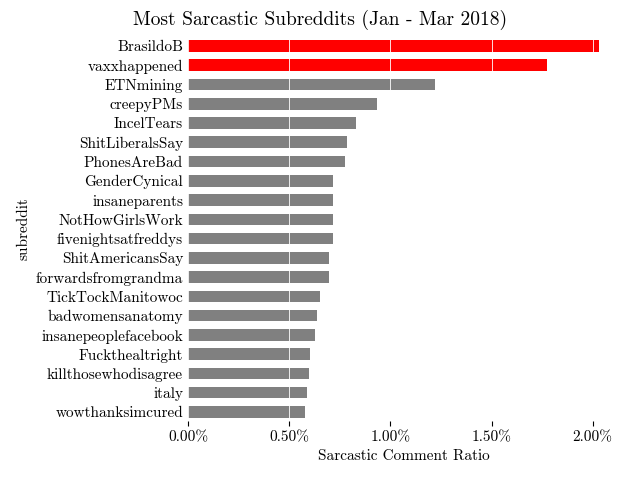

```{r setup, include=FALSE}
knitr::opts_chunk$set(echo = FALSE,cache = TRUE)
```

```{r Libraries, include=FALSE}
# Loading libraries
library(conflicted)
library(tm)
library(MLmetrics)
library(glmnet)
library(qdapRegex)
library(car)
library(plm)
library(reshape2)
library(tidyverse)
library(glmnet)
library(ggplot2)
library(uchardet)
library(word2vec)
library(text2vec)
library(regclass)
conflicts_prefer(MLmetrics::Recall)
```

\newpage

```{r Loading in data}
# Load in data
data <- read.csv("../data/NHGW.csv")
data <- data[,2:3]
```

```{r Create Corpus}
y <- data$Sarcastic
doc_id <- 1:nrow(data)
data$doc_id <- doc_id
data_clean <- data[,c("Body","doc_id")]
colnames(data_clean)[1] <- "text"
data_clean$text <- rm_non_words(data_clean$text)

# Construct Corpus
ds <- DataframeSource(data_clean)
corpus <- Corpus(ds)
```

```{r Clean Corpus}
# Clean the Corpus
# Remove punctuation
corpus <- tm_map(corpus, content_transformer(removePunctuation))
# Send everything to lower case
corpus <- tm_map(corpus, content_transformer(tolower))
# Remove stopwords
corpus <- tm_map(corpus, content_transformer(removeWords), 
          stopwords("english"))
# Remove whitespace
corpus <- tm_map(corpus, stripWhitespace)
# Remove numbers
corpus <- tm_map(corpus, content_transformer(removeNumbers))
# Stemming
corpus <- tm_map(corpus, stemDocument)
```

```{r Create TF-IDF DTM}
# Create DTM object
dtm <- DocumentTermMatrix(corpus)
# Weight TF-IDF
tfidf_dtm <- weightTfIdf(dtm)
```

## Daniel's Analysis (better title later)

### Base Model

The dimension of the DTM is too large by default. Can't use bestGLM as too many predictors. Do form of best subset by checking quantities of TF-IDF.

```{r Creating Quantile List}
# Set seed
set.seed(874)

# Do 80/20 train/test split
train_idx <- sample(1:nrow(data),floor(.8*(nrow(data))))
test_idx <- setdiff(1:nrow(data),train_idx)

# Get quantiles
tfidf_mat <- as.matrix(tfidf_dtm[train_idx,])

tfidf_vec <- as.vector(tfidf_mat)

tfidf_vec <- tfidf_vec[tfidf_vec > 0]

quants <- quantile(tfidf_vec, probs = seq(0.1,0.95,0.05))

# Only keep quantiles that result in matrices with fewer columns than rows
cols <- c()
for (quant in quants) {
  cols <- c(cols, ncol(tfidf_dtm[train_idx,tfidf_dtm$v > quant]))
}

 numRows <- nrow(tfidf_dtm[train_idx,])
 quants <- quants[which(cols < numRows)]
```

```{r Perform Best Subset Regression, cache=TRUE, message=FALSE,warning=FALSE}
# Get AICs for different subsets
models_aic <- list()
for (quant in quants) {
  # Filter DTM
  tfidf_dtm_r <- tfidf_dtm[train_idx, tfidf_dtm$v > quant]
  
  # Construct dataframe for fitting
  x <- as.data.frame(as.matrix(tfidf_dtm_r))
  y_train <- y[train_idx]
  data <- cbind(y_train, x)
  
  # Fit model
  glm.out <- glm(y_train ~ ., family = binomial, data)
  models_aic <- append(models_aic, glm.out$aic)
}

# Get best quantitle threshold by AIC
thresh <- quants[which.min(models_aic)]
```

The 95% percentile gave the best AIC so this is the base model I will select.

```{r Fit 95th Percentile Mode, warning=FALSE}
# Filter DTM
tfidf_dtm_r <- tfidf_dtm[train_idx,tfidf_dtm$v > thresh  ]

# Construct dataframe for fitting
x <- as.data.frame(as.matrix(tfidf_dtm_r))
y_train <- y[train_idx]
data <- cbind(y_train,x)

# Fit model
glm.out <- glm(y_train~., family = binomial, data)

# Percent reduction in deviance
per_dev_red_base <- 1 - glm.out$deviance/glm.out$null.deviance
```

There are several NAs, not good. Let's get results.

```{r Train Metrics for Base}
# Get predictions
predict.out <- predict(glm.out, type = "response")
predict.out[which(predict.out >= 0.5)] <- 1
predict.out[which(predict.out < 0.5)] <- 0
guess <- data.frame(predict.out)

# Format output
output <- cbind(guess, y[train_idx])
colnames(output)[2] <- "truth"
y_true <- output$truth
y_pred <- output$predict.out

# Get metrics
Re_base_train <- Recall(y_true, y_pred, positive = 1)
Pr_base_train <- Precision(y_true, y_pred, positive = 1)
F1_base_train <- F1_Score(y_true, y_pred, positive = 1)
```

```{r Test Metrics for Base, warning=FALSE}
# Get predictions
test_data <- cbind(as.data.frame(as.matrix(tfidf_dtm[test_idx,])))
predict.out <- predict(glm.out, newdata = test_data ,type="response")
predict.out[which(predict.out >= 0.5)] <- 1
predict.out[which(predict.out < 0.5)] <- 0
guess <- data.frame(predict.out)

# Format output
output <- cbind(guess,y[test_idx])
colnames(output)[2] <- "truth"
y_true <- output$truth
y_pred <- output$predict.out

# Get metrics
Re_base_test <- Recall(y_true, y_pred, positive = 1)
Pr_base_test <- Precision(y_true, y_pred, positive = 1)
F1_base_test <- F1_Score(y_true, y_pred, positive = 1)
```

```{r VIFs Base Model, warning=FALSE}
# Cannot use VIF if there are NAs, remove them
dropterms <-
  names(glm.out$coefficients[is.na(glm.out$coefficients)])
x <- x[, which(!(colnames(x) %in% dropterms))]
data <- cbind(y_train, x)
glm.out <- glm(y_train ~ ., family = binomial, data)

# 6 VIFs over 10 serious collinearity problems
VIFs_base <- vif(glm.out) 
```

High VIFs, bad need to reduce collineairty. We try PCA now.

### PCA

We keep up to 90th percentile

```{r Perform PCA, warning=FALSE}
pca.out <- prcomp(as.data.frame(as.matrix(tfidf_dtm_r)))
pca.out.test <- predict(pca.out, as.data.frame(as.matrix(tfidf_dtm[test_idx,])))

# 90th cumulative proportion is given by PC1:PC16
pcs <- as.data.frame(pca.out$x[,1:16])
train_data <- cbind(y_train,pcs)
test_data <- as.data.frame(pca.out.test[,1:16])

# Fit model
glm.out <- glm(y_train~., family = binomial, train_data)

# Percent reduction in deviance
per_dev_red_PCA <- glm.out$deviance/glm.out$null.deviance # note this is actually an increase by a factor of 25.17876
```

```{r Train Metrics for PCA}
# Get predictions
predict.out <- predict(glm.out, type = "response")
predict.out[which(predict.out >= 0.5)] <- 1
predict.out[which(predict.out < 0.5)] <- 0
guess <- data.frame(predict.out)

# Format output
output <- cbind(guess, y[train_idx])
colnames(output)[2] <- "truth"
y_true <- output$truth
y_pred <- output$predict.out

# Get metrics
Re_PCA_train <- Recall(y_true, y_pred, positive = 1)
Pr_PCA_train <- Precision(y_true, y_pred, positive = 1)
F1_PCA_train <- F1_Score(y_true, y_pred, positive = 1)
```

```{r Test Metrics for PCA, warning=FALSE}
# Get predictions
predict.out <- predict(glm.out, newdata = test_data ,type="response")
predict.out[which(predict.out >= 0.5)] <- 1
predict.out[which(predict.out < 0.5)] <- 0
guess <- data.frame(predict.out)

# Format output
output <- cbind(guess,y[test_idx])
colnames(output)[2] <- "truth"
y_true <- output$truth
y_pred <- output$predict.out

# Get metrics
Re_PCA_test <- Recall(y_true, y_pred, positive = 1)
Pr_PCA_test <- Precision(y_true, y_pred, positive = 1)
F1_PCA_test <- F1_Score(y_true, y_pred, positive = 1)
```

Very not good predicts everything as not sar.

```{r VIFs PCA Model, warning=FALSE}
# All 1
VIFs_PCA <- vif(glm.out) 
```

### LASSO

```{r Fit LASSO}
# Construct dataframe for fitting
x <- as.data.frame(as.matrix(tfidf_dtm[train_idx,]))
y_train <- y[train_idx]
data <- cbind(y_train,x)
test_data <- cbind(as.data.frame(as.matrix(tfidf_dtm[test_idx,])))

# Perform CV
glmnet.cv.out <- cv.glmnet(as.matrix(x),y_train,family="binomial",alpha = 1)
best_lambda <- glmnet.cv.out$lambda.min

# Fit best found model
glmnet.out <- glmnet(as.matrix(x),y_train,family="binomial",alpha = 1,lambda = best_lambda)
```

```{r Train Metrics for LASSO, warning=FALSE}
# Get predictions
predict.out <- predict(glmnet.out, as.matrix(x),type = "response")
predict.out[which(predict.out >= 0.5)] <- 1
predict.out[which(predict.out < 0.5)] <- 0
guess <- data.frame(predict.out)

# Format output
output <- cbind(guess, y[train_idx])
colnames(output)[2] <- "truth"
y_true <- output$truth
y_pred <- output$s0

# Get metrics
Re_LASSO_train <- Recall(y_true, y_pred, positive = 1)
Pr_LASSO_train <- Precision(y_true, y_pred, positive = 1)
F1_LASSO_train <- F1_Score(y_true, y_pred, positive = 1)
```

```{r Test Metrics for LASSO, warning=FALSE}
# Get predictions
test_data <- as.matrix(tfidf_dtm[test_idx,rownames(glmnet.out$beta)])
predict.out <- predict(glmnet.out,newx = test_data,type="response")
predict.out[which(predict.out >= 0.5)] <- 1
predict.out[which(predict.out < 0.5)] <- 0
guess <- data.frame(predict.out)

# Format output
output <- cbind(guess, y[test_idx])
colnames(output)[2] <- "truth"
y_true <- output$truth
y_pred <- output$s0

# Get metrics
Re_LASSO_test <- Recall(y_true, y_pred, positive = 1)
Pr_LASSO_test <- Precision(y_true, y_pred, positive = 1)
F1_LASSO_test <- F1_Score(y_true, y_pred, positive = 1)
```

### Weighted Base Model

```{r Get results for weighted base model, warning=FALSE}
# Recreate DTM
tfidf_dtm_r <- tfidf_dtm[train_idx, tfidf_dtm$v > thresh]

# Construct dataframe for fitting
x <- as.data.frame(as.matrix(tfidf_dtm_r))
y_train <- y[train_idx]
data <- cbind(y_train, x)
test_data <- cbind(as.data.frame(as.matrix(tfidf_dtm[test_idx, ])))
results_base_weighted <-
  data.frame(Re = NA,
             Pr = NA,
             F1 = NA,
             w1 = NA)

# For each weight calculate metrics
for (w1 in seq(0, 1, 0.01)) {
  weights <- c()
  # w1 = 0.01
  w2 = 1 - w1
  
  for (i in 1:length(y_train)) {
    if (y_train[i] == 1) {
      weights <- c(weights, w1)
    } else{
      weights <- c(weights, w2)
    }
  }
  
  # Fit model
  glm.out <-
    glm(y_train ~ .,
        family = binomial,
        data = data,
        weights = weights)
  
  # Get results
  predict.out <-
    predict(glm.out, newdata = test_data , type = "response")
  predict.out[which(predict.out >= 0.5)] <- 1
  predict.out[which(predict.out < 0.5)] <- 0
  guess <- data.frame(predict.out)
  output <- cbind(guess, y[test_idx])
  colnames(output)[2] <- "truth"
  y_true <- output$truth
  y_pred <- output$predict.out
  
  # Get metrics
  Re <- Recall(y_true, y_pred, positive = 1)
  Pr <- Precision(y_true, y_pred, positive = 1)
  F1 <- F1_Score(y_true, y_pred, positive = 1)
  
  results_base_weighted <-
    rbind(results_base_weighted, data.frame(
      Re = Re,
      Pr = Pr,
      F1 = F1,
      w1 = w1
    ))
}
results_base_weighted <- na.omit(results_base_weighted)
```

```{r Visualize results_base_weighted}
# Reshape data 
results_long <- melt(results_base_weighted, id.vars = "w1", 
                     variable.name = "y_var", value.name = "value")

# Visualize
ggplot(results_long, aes(x = w1, y = value, color = y_var)) +
  geom_point()
```

We want a F1 that balances Recall and Precision but still focuses on Recall. Anything around 0.75 is good.

```{r Fit optimal base weighting, warning=FALSE}
# Fit model
w1 = 0.75
w2 = 1 - w1
weights <- c()

for (i in 1:length(y_train)) {
  if (y_train[i] == 1) {
    weights <- c(weights, w1)
  } else{
    weights <- c(weights, w2)
  }
}

# Fit model
glm.out <-
  glm(y_train ~ .,
      family = binomial,
      data = data,
      weights = weights)

# Percent reduction in deviance
per_dev_red_base_weighted <- 1 - glm.out$deviance/glm.out$null.deviance
```

```{r Test Metrics for Base Weighted, warning=FALSE}
# Get predictions
test_data <- cbind(as.data.frame(as.matrix(tfidf_dtm[test_idx, ])))
predict.out <-
  predict(glm.out, newdata = test_data , type = "response")
predict.out[which(predict.out >= 0.5)] <- 1
predict.out[which(predict.out < 0.5)] <- 0
guess <- data.frame(predict.out)

# Format output
output <- cbind(guess, y[test_idx])
colnames(output)[2] <- "truth"
y_true <- output$truth
y_pred <- output$predict.out

# Get metrics
Re_base_weighted_test <- Recall(y_true, y_pred, positive = 1)
Pr_base_weighted_test <- Precision(y_true, y_pred, positive = 1)
F1_base_weighted_test <- F1_Score(y_true, y_pred, positive = 1)
```

```{r VIFs Base Weighted Model, warning=FALSE}
# Cannot use VIF if there are NAs, remove them
dropterms <-
  names(glm.out$coefficients[is.na(glm.out$coefficients)])
x <- x[, which(!(colnames(x) %in% dropterms))]
data <- cbind(y_train, x)
glm.out <- glm(y_train ~ ., family = binomial, data)

# 5 VIFs over 10
VIFs_weighted_base <- vif(glm.out) 
```

### Weighted PCA

```{r Get results for weighted PCA model, warning=FALSE}
# Recreate DTM
tfidf_dtm_r <- tfidf_dtm[train_idx, tfidf_dtm$v > thresh]

pca.out <- prcomp(as.data.frame(as.matrix(tfidf_dtm_r)))
pca.out.test <- predict(pca.out, as.data.frame(as.matrix(tfidf_dtm[test_idx,])))

# 90th cumulative proportion is given by PC1:PC24
pcs <- as.data.frame(pca.out$x[,1:24])
train_data <- cbind(y_train,pcs)
test_data <- as.data.frame(pca.out.test[,1:24])

# Create results dataframe
results_weighted_pca <-
  data.frame(Re = NA,
             Pr = NA,
             F1 = NA,
             w1 = NA)

# For each weight calculate metrics
for (w1 in seq(0, 1, 0.01)) {
  weights <- c()
  # w1 = 0.01
  w2 = 1 - w1
  
  for (i in 1:length(y_train)) {
    if (y_train[i] == 1) {
      weights <- c(weights, w1)
    } else{
      weights <- c(weights, w2)
    }
  }
  
  # Fit model
  glm.out <-
    glm(y_train ~ .,
        family = binomial,
        data = train_data,
        weights = weights)
  
  # Get results
  predict.out <-
    predict(glm.out, newdata = test_data , type = "response")
  predict.out[which(predict.out >= 0.5)] <- 1
  predict.out[which(predict.out < 0.5)] <- 0
  guess <- data.frame(predict.out)
  output <- cbind(guess, y[test_idx])
  colnames(output)[2] <- "truth"
  y_true <- output$truth
  y_pred <- output$predict.out
  
  # Get metrics
  Re <- Recall(y_true, y_pred, positive = 1)
  Pr <- Precision(y_true, y_pred, positive = 1)
  F1 <- F1_Score(y_true, y_pred, positive = 1)
  
  results_weighted_pca <-
    rbind(results_weighted_pca, data.frame(
      Re = Re,
      Pr = Pr,
      F1 = F1,
      w1 = w1
    ))
}
results_weighted_pca <- na.omit(results_weighted_pca)
```

```{r Visualize results_PCA_weighted}
# Reshape data 
results_long <- melt(results_weighted_pca, id.vars = "w1", 
                     variable.name = "y_var", value.name = "value")

# Visualize
ggplot(results_long, aes(x = w1, y = value, color = y_var)) +
  geom_point() 
```

F1 holds pretty steady. We go for the one that has the highest Recall, a reasonable precision, and w good F1. 0.62 has

```{r Fit optimal PCA weighting, warning=FALSE}
# Fit model
w1 = 0.62
w2 = 1 - w1
weights <- c()

for (i in 1:length(y_train)) {
  if (y_train[i] == 1) {
    weights <- c(weights, w1)
  } else{
    weights <- c(weights, w2)
  }
}

# Fit model
glm.out <-
  glm(y_train ~ .,
      family = binomial,
      data = train_data,
      weights = weights)

# Percent reduction in deviance
per_dev_red_PCA <- glm.out$deviance/glm.out$null.deviance # note this is actually an increase by a factor of 19.96864
```

```{r Train Metrics for Weighted PCA}
# Get predictions
predict.out <- predict(glm.out, type = "response")
predict.out[which(predict.out >= 0.5)] <- 1
predict.out[which(predict.out < 0.5)] <- 0
guess <- data.frame(predict.out)

# Format output
output <- cbind(guess, y[train_idx])
colnames(output)[2] <- "truth"
y_true <- output$truth
y_pred <- output$predict.out

# Get metrics
Re_weighted_PCA_train <- Recall(y_true, y_pred, positive = 1)
Pr_weighted_PCA_train <- Precision(y_true, y_pred, positive = 1)
F1_weighted_PCA_train <- F1_Score(y_true, y_pred, positive = 1)
```

```{r Test Metrics for Weighted PCA, warning=FALSE}
# Get predictions
predict.out <- predict(glm.out, newdata = test_data ,type="response")
predict.out[which(predict.out >= 0.5)] <- 1
predict.out[which(predict.out < 0.5)] <- 0
guess <- data.frame(predict.out)

# Format output
output <- cbind(guess,y[test_idx])
colnames(output)[2] <- "truth"
y_true <- output$truth
y_pred <- output$predict.out

# Get metrics
Re_weighted_PCA_test <- Recall(y_true, y_pred, positive = 1)
Pr_weighted_PCA_test <- Precision(y_true, y_pred, positive = 1)
F1_weighted_PCA_test <- F1_Score(y_true, y_pred, positive = 1)
```

```{r VIFs Weighted PCA Model, warning=FALSE}
# All 1
VIFs_weighted_PCA <- vif(glm.out) # none over 10
```

### Weighted LASSO

```{r refit best LASSO}
# Construct dataframe for fitting
x <- as.data.frame(as.matrix(tfidf_dtm[train_idx,]))
y_train <- y[train_idx]
data <- cbind(y_train,x)
test_data <- cbind(as.data.frame(as.matrix(tfidf_dtm[test_idx,])))

# Fit best found model
glmnet.out <- glmnet(as.matrix(x),y_train,family="binomial",alpha = 1,lambda = best_lambda)
```

```{r Get results for weighted LASSO model, warning=FALSE}
# Construct dataframe for fitting
x <- as.data.frame(as.matrix(tfidf_dtm[train_idx, ]))
y_train <- y[train_idx]
data <- cbind(y_train, x)
test_data <- as.matrix(tfidf_dtm[test_idx, ])

# Create results dataframe
results_weighted_lasso <-
  data.frame(Re = NA,
             Pr = NA,
             F1 = NA,
             w1 = NA)

# For each weight calculate metrics
for (w1 in seq(0.01, 0.99, 0.01)) {
  weights <- c()
  # w1 = 0.1
  w2 = 1 - w1
  
  for (i in 1:length(y_train)) {
    if (y_train[i] == 1) {
      weights <- c(weights, w1)
    } else{
      weights <- c(weights, w2)
    }
  }
  
  # Fit model
  glmnet.out <-
    glmnet(
      as.matrix(x),
      y_train,
      family = "binomial",
      alpha = 1,
      lambda = best_lambda,
      weights = weights
    )
  
  # Get results
  predict.out <-
    predict(glmnet.out, newx = test_data , type = "response")
  predict.out[which(predict.out >= 0.5)] <- 1
  predict.out[which(predict.out < 0.5)] <- 0
  guess <- data.frame(predict.out)
  output <- cbind(guess, y[test_idx])
  colnames(output)[2] <- "truth"
  y_true <- output$truth
  y_pred <- output$s0
  
  # Get metrics
  Re <- Recall(y_true, y_pred, positive = 1)
  Pr <- Precision(y_true, y_pred, positive = 1)
  F1 <- F1_Score(y_true, y_pred, positive = 1)
  
  results_weighted_lasso <-
    rbind(results_weighted_lasso, data.frame(
      Re = Re,
      Pr = Pr,
      F1 = F1,
      w1 = w1
    ))
}
results_weighted_lasso <- na.omit(results_weighted_lasso)
```

```{r Visualize results_weighted_lasso}
# Reshape data 
results_long <- melt(results_weighted_lasso, id.vars = "w1", 
                     variable.name = "y_var", value.name = "value")

# Visualize
ggplot(results_long, aes(x = w1, y = value, color = y_var)) +
  geom_point() 
```

0.55 is best

```{r Fit optimal LASSO weighting, warning=FALSE}
# Fit model
w1 = 0.55
w2 = 1 - w1
weights <- c()

for (i in 1:length(y_train)) {
  if (y_train[i] == 1) {
    weights <- c(weights, w1)
  } else{
    weights <- c(weights, w2)
  }
}

 # Fit model
  glmnet.out <-
    glmnet(
      as.matrix(x),
      y_train,
      family = "binomial",
      alpha = 1,
      lambda = best_lambda,
      weights = weights
    )
  
# Percent reduction in deviance
per_dev_red_weighted_Lasso <- glmnet.out$dev.ratio
```

```{r Train Metrics for Weighted LASSO}
# Get predictions
predict.out <- predict(glmnet.out,newx = as.matrix(x), type = "response")
predict.out[which(predict.out >= 0.5)] <- 1
predict.out[which(predict.out < 0.5)] <- 0
guess <- data.frame(predict.out)

# Format output
output <- cbind(guess, y[train_idx])
colnames(output)[2] <- "truth"
y_true <- output$truth
y_pred <- output$s0

# Get metrics
Re_weighted_LASSO_train <- Recall(y_true, y_pred, positive = 1)
Pr_weighted_LASSO_train <- Precision(y_true, y_pred, positive = 1)
F1_weighted_LASSO_train <- F1_Score(y_true, y_pred, positive = 1)
```

```{r Test Metrics for Weighted LASSO, warning=FALSE}
# Get predictions
predict.out <- predict(glmnet.out, newx = test_data ,type="response")
predict.out[which(predict.out >= 0.5)] <- 1
predict.out[which(predict.out < 0.5)] <- 0
guess <- data.frame(predict.out)

# Format output
output <- cbind(guess,y[test_idx])
colnames(output)[2] <- "truth"
y_true <- output$truth
y_pred <- output$s0

# Get metrics
Re_weighted_LASSO_test <- Recall(y_true, y_pred, positive = 1)
Pr_weighted_LASSO_test <- Precision(y_true, y_pred, positive = 1)
F1_weighted_LASSO_test <- F1_Score(y_true, y_pred, positive = 1)
```

## Keiran's Analysis (better title later)

## Ross' Analysis (better title later)

```{r GloVe Loading Data, warning=FALSE}
reddit_data <- read.csv("../data/NHGW.csv",header=T, encoding = "UTF-8")
attach(reddit_data)
```

```{r GloVe Cleaning Data, warning=FALSE}
#removing punctuation
reddit_data$Body = removePunctuation(reddit_data$Body, ucp=TRUE)
#everything lowercase
reddit_data$Body = tolower(reddit_data$Body)
#remove stopwords
reddit_data$Body = removeWords(reddit_data$Body, stopwords("english"))
#strip whitespace
reddit_data$Body = stripWhitespace(reddit_data$Body)
#remove numbers
reddit_data$Body = removeNumbers(reddit_data$Body)
#stemming
reddit_data$Body = stemDocument(reddit_data$Body)
#convert encoding
reddit_data$Body = txt_clean_word2vec(reddit_data$Body)
#remove NA rows
reddit_data = na.omit(reddit_data)
#remove rows with NA encoding
n = nrow(reddit_data)
for(i in 1:n){
  if(is.na(detect_str_enc(reddit_data[i,]$Body))){
    reddit_data <- reddit_data[-c(i),]
  }
}
any(is.na(detect_str_enc(reddit_data$Body)))
```

```{r GloVe Creating Training/Testing Datasets, warning=FALSE}
# split into training and testing sets
set.seed(874)
N = nrow(reddit_data)                                      
n = round(N*0.8)                               
m = N-n 
tr_ind <- sample(N, n)            
te_ind <- setdiff(seq_len(N), tr_ind)

reddit_train <- reddit_data[tr_ind,]
reddit_test <- reddit_data[te_ind,]
```

```{r GloVe Vector Sum Function, warning=FALSE}
# creating a function to make sentences into vectors
sentence_vec <- function(words){
  sum <- 0
  for(x in 1:nrow(words)){
    if(words[x,1] %in% rownames(word_vectors)){
      sum <- sum + word_vectors[words[x,1], ,drop = FALSE]
    }
  }
  return(sum)
}
```

```{r GloVe Finding Best Dimension for GloVe Model, warning=FALSE}
#create empty aic and dim vectors
aic_vec = c()
dim_vec = c()
reddit_data = na.omit(reddit_data)

  # Create iterator over tokens
  tokens <- space_tokenizer(reddit_train$Body)
  # Create vocabulary. Terms will be unigrams (simple words).
  it = itoken(tokens, progressbar = FALSE)
  vocab <- create_vocabulary(it)
  vocab <- prune_vocabulary(vocab, term_count_min = 5L) # wonder which of 3-5 is best
  
  vectorizer <- vocab_vectorizer(vocab)
  # use window of 5 for context words
  tcm <- create_tcm(it, vectorizer, skip_grams_window = 5L)
  
#for(i in 1:200){
  # fitting the GLOVE model
  glove = GlobalVectors$new(rank = 140, x_max = 10)
  wv_main = glove$fit_transform(tcm, n_iter = 10, convergence_tol = 0.01, n_threads = 8)
  
  # creating word vectors
  wv_context = glove$components
  word_vectors = wv_main + t(wv_context)

  training_mat <- c()
  for(x in 1:nrow(reddit_train)){
    token <- space_tokenizer(reddit_train$Body[x])
    words = itoken(token, progressbar = FALSE)
    words <- create_vocabulary(words)
    sentenceVec <- sentence_vec(words)
    training_mat <- rbind(training_mat, sentenceVec)
  }

  training_mat <- cbind(reddit_train$Sarcastic, training_mat)
  training_mat <- data.frame(training_mat)
  colnames(training_mat)[1] <- "sarcasm"

  #fit logsitic regression
  log_reg = glm(sarcasm~., family='binomial', data=training_mat)
  #print(summary(log_reg))
  #append values
  aic_vec = append(aic_vec, log_reg$aic)
  dim_vec = append(dim_vec, i)
#}

#plot results
plot(dim_vec, aic_vec, ylab="AIC", xlab="Dimensions in word2vec model", ylim = c(0,800))
```

140 dimensions gives the best model for logistic regression

### Base Model

```{r GloVe Create Base Model, warning=FALSE}
glove = GlobalVectors$new(rank = 140, x_max = 10)
wv_main = glove$fit_transform(tcm, n_iter = 10, convergence_tol = 0.01, n_threads = 8)
  
# creating word vectors
wv_context = glove$components
word_vectors = wv_main + t(wv_context)

# creating training matrix
training_mat <- c()
for(x in 1:nrow(reddit_train)){
  token <- space_tokenizer(reddit_train$Body[x])
  words = itoken(token, progressbar = FALSE)
  words <- create_vocabulary(words)
  sentenceVec <- sentence_vec(words)
  training_mat <- rbind(training_mat, sentenceVec)
}

training_mat <- cbind(reddit_train$Sarcastic, training_mat)
training_mat <- data.frame(training_mat)
colnames(training_mat)[1] <- "sarcasm"

# creating testing matrix
testing_mat <- c()
for(x in 1:nrow(reddit_test)){
  token <- space_tokenizer(reddit_test$Body[x])
  words <- itoken(token, progressbar = FALSE)
  words <- create_vocabulary(words)
  sentenceVec <- sentence_vec(words)
  testing_mat <- rbind(testing_mat, sentenceVec)
}

testing_mat <- cbind(reddit_train$Sarcastic, testing_mat)
testing_mat <- data.frame(testing_mat)
colnames(testing_mat)[1] <- "sarcasm"


#fit logsitic regression
log_reg = glm(sarcasm~., family='binomial', data=training_mat)
# summary(log_reg)
```

```{r GloVe Train Metrics for Base, warning=FALSE}
# Get predictions
predict.out <- predict(log_reg, type = "response")
predict.out[which(predict.out >= 0.5)] <- 1
predict.out[which(predict.out < 0.5)] <- 0
guess <- data.frame(predict.out)
# Format output
output <- cbind(guess, training_mat[,1])
colnames(output)[2] <- "truth"
y_true <- output$truth
y_pred <- output$predict.out
# Get metrics
Re_base_train <- Recall(y_true, y_pred, positive = 1)
Pr_base_train <- Precision(y_true, y_pred, positive = 1)
F1_base_train <- F1_Score(y_true, y_pred, positive = 1)
```

```{r GloVe Test Metrics for Base, warning=FALSE}
# Get predictions
predict.out <- predict(log_reg, newdata = testing_mat ,type="response")
predict.out[which(predict.out >= 0.5)] <- 1
predict.out[which(predict.out < 0.5)] <- 0
guess <- data.frame(predict.out)
# Format output
output <- cbind(guess,testing_mat[,1])
colnames(output)[2] <- "truth"
y_true <- output$truth
y_pred <- output$predict.out
# Get metrics
Re_base_test <- Recall(y_true, y_pred, positive = 1)
Pr_base_test <- Precision(y_true, y_pred, positive = 1)
F1_base_test <- F1_Score(y_true, y_pred, positive = 1)
```

```{r GloVe VIFs Base Model, warning=FALSE}
# 10 VIFs over 10, serious collinearity problems
VIFs_base <- vif(log_reg) 
```

### PCA

```{r GloVe Perform PCA, warning=FALSE}

pca.out <- prcomp(as.data.frame(as.matrix(training_mat[,2:141])))
pca.out.test <- predict(pca.out, as.data.frame(testing_mat[,2:141]))

#first 71 pc explain 90% of the variance
#summary(pca.out)

pcs <- as.data.frame(pca.out$x[,1:71])

train_data <- cbind(reddit_train$Sarcastic,pcs)
colnames(train_data)[1] <- "sarcasm"


# Fit model
log_reg = glm(sarcasm~., family='binomial', data=train_data)
```

```{r GloVe Train Metrics for PCA, warning=FALSE}
predict.out <- predict(log_reg,type="response")
predict.out[which(predict.out >= 0.5)] <- 1
predict.out[which(predict.out < 0.5)] <- 0
guess <- data.frame(predict.out)
# Format output
output <- cbind(guess,training_mat[,1])
colnames(output)[2] <- "truth"
y_true <- output$truth
y_pred <- output$predict.out
# Get metrics
Re_PCA_train <- Recall(y_true, y_pred, positive = 1)
Pr_PCA_train <- Precision(y_true, y_pred, positive = 1)
F1_PCA_train <- F1_Score(y_true, y_pred, positive = 1)
```

```{r GloVe Test Metrics for PCA, warning=FALSE}
predict.out <- predict(log_reg,newdata = as.data.frame(pca.out.test),type="response")
predict.out[which(predict.out >= 0.5)] <- 1
predict.out[which(predict.out < 0.5)] <- 0
guess <- data.frame(predict.out)
# Format output
output <- cbind(guess,testing_mat[,1])
colnames(output)[2] <- "truth"
y_true <- output$truth
y_pred <- output$predict.out
# Get metrics
Re_PCA_test <- Recall(y_true, y_pred, positive = 1)
Pr_PCA_test <- Precision(y_true, y_pred, positive = 1)
F1_PCA_test <- F1_Score(y_true, y_pred, positive = 1)
```

```{r GloVe VIFs PCA Model, warning=FALSE}
# All 1
VIFs_PCA <- vif(log_reg) 
```

### LASSO

```{r GloVe Fit LASSO, warning=FALSE}
# Construct matrix for fitting
x_train <- as.matrix(training_mat[,2:141])
y_train <- training_mat[,1]

# Perform CV
glmnet.cv.out <- cv.glmnet(x_train,y_train,family="binomial",alpha = 1)
best_lambda <- glmnet.cv.out$lambda.min

# Fit best found model
glmnet.out <- glmnet(x_train,y_train,family="binomial",alpha = 1,lambda = best_lambda)
```

```{r GloVe Train Metrics for LASSO, warning=FALSE}
# Get predictions
predict.out <- predict(glmnet.out, as.matrix(training_mat[,2:141]),type = "response")
predict.out[which(predict.out >= 0.5)] <- 1
predict.out[which(predict.out < 0.5)] <- 0
guess <- data.frame(predict.out)
# Format output
output <- cbind(guess, training_mat[,1])
colnames(output)[2] <- "truth"
y_true <- output$truth
y_pred <- output$s0
# Get metrics
Re_LASSO_train <- Recall(y_true, y_pred, positive = 1)
Pr_LASSO_train <- Precision(y_true, y_pred, positive = 1)
F1_LASSO_train <- F1_Score(y_true, y_pred, positive = 1)
```

```{r GloVe Test Metrics for LASSO, warning=FALSE}
# Get predictions
predict.out <- predict(glmnet.out,newx = as.matrix(testing_mat[,2:141]),type="response")
predict.out[which(predict.out >= 0.5)] <- 1
predict.out[which(predict.out < 0.5)] <- 0
guess <- data.frame(predict.out)
# Format output
output <- cbind(guess, testing_mat[,1])
colnames(output)[2] <- "truth"
y_true <- output$truth
y_pred <- output$s0
# Get metrics
Re_LASSO_test <- Recall(y_true, y_pred, positive = 1)
Pr_LASSO_test <- Precision(y_true, y_pred, positive = 1)
F1_LASSO_test <- F1_Score(y_true, y_pred, positive = 1)
```

### Weighted Base Model

```{r GloVe Get results for weighted base model, warning=FALSE}
# Construct dataframe for fitting
x_train <- as.data.frame(as.matrix(training_mat[,2:141]))
y_train <- training_mat[,1]
results_base_weighted <- data.frame(Re = NA,Pr = NA,F1 = NA,w1 = NA)

# For each weight calculate metrics
for (w1 in seq(0, 1, 0.01)) {
  weights <- c()
  # w1 = 0.01
  w2 = 1 - w1
  
  for (i in 1:length(y_train)) {
    if (training_mat[i,1] == 1) {
      weights <- c(weights, w1)
    } else{
      weights <- c(weights, w2)
    }
  }
  
  # Fit model
  glm.out <- glm(y_train ~ .,family = binomial,data = x_train,weights = weights)
  
  # Get results
  predict.out <- predict(glm.out, newdata = testing_mat[,2:141] , type = "response")
  predict.out[which(predict.out >= 0.5)] <- 1
  predict.out[which(predict.out < 0.5)] <- 0
  guess <- data.frame(predict.out)
  output <- cbind(guess, testing_mat[,1])
  colnames(output)[2] <- "truth"
  y_true <- output$truth
  y_pred <- output$predict.out
  
  # Get metrics
  Re <- Recall(y_true, y_pred, positive = 1)
  Pr <- Precision(y_true, y_pred, positive = 1)
  F1 <- F1_Score(y_true, y_pred, positive = 1)
  
  results_base_weighted <- rbind(results_base_weighted, data.frame(Re = Re,Pr = Pr,F1 = F1,w1 = w1))
}
results_base_weighted <- na.omit(results_base_weighted)
```

```{r GloVe Visualize results_base_weighted, warning=FALSE}
# Reshape data 
results_long <- melt(results_base_weighted, id.vars = "w1", variable.name = "y_var", value.name = "value")
# Visualize
ggplot(results_long, aes(x = w1, y = value, color = y_var)) + geom_point()
```

We want a F1 that balances Recall and Precision but still focuses on Recall. Anything around 0.7 is good.

```{r GloVe Fit optimal base weighting, warning=FALSE}
# Fit model
w1 = 0.7
w2 = 1 - w1
weights <- c()
for (i in 1:length(y_train)) {
  if (y_train[i] == 1) {
    weights <- c(weights, w1)
  } else{
    weights <- c(weights, w2)
  }
}
# Fit model
glm.out <- glm(y_train ~ .,family = binomial,data = x_train,weights = weights)
# Percent reduction in deviance
per_dev_red_base_weighted <- 1 - glm.out$deviance/glm.out$null.deviance
```

```{r GloVe Test Metrics for Base Weighted, warning=FALSE}
# Get predictions
test_data <- cbind(as.data.frame(as.matrix(testing_mat[,2:141])))
predict.out <- predict(glm.out, newdata = test_data , type = "response")
predict.out[which(predict.out >= 0.5)] <- 1
predict.out[which(predict.out < 0.5)] <- 0
guess <- data.frame(predict.out)
# Format output
output <- cbind(guess, testing_mat[,1])
colnames(output)[2] <- "truth"
y_true <- output$truth
y_pred <- output$predict.out
# Get metrics
Re_base_weighted_test <- Recall(y_true, y_pred, positive = 1)
Pr_base_weighted_test <- Precision(y_true, y_pred, positive = 1)
F1_base_weighted_test <- F1_Score(y_true, y_pred, positive = 1)
```

```{r GloVe VIFs Base Weighted Model, warning=FALSE}
# Most of the VIFs over 10
VIFs_weighted_base <- vif(glm.out) 
```

### Weighted PCA

```{r GloVe Get results for weighted PCA model, warning=FALSE}
y_train <- training_mat[,1]
pca.out <- prcomp(as.data.frame(as.matrix(training_mat[,2:141])))
pca.out.test <- predict(pca.out, as.data.frame(as.matrix(testing_mat[,2:141])))
# 90th cumulative proportion is given by PC1:PC24
pcs <- as.data.frame(pca.out$x[,1:71])
train_data <- cbind(y_train,pcs)
test_data <- as.data.frame(pca.out.test[,1:71])
# Create results dataframe
results_weighted_pca <- data.frame(Re = NA, Pr = NA, F1 = NA, w1 = NA)
# For each weight calculate metrics
for (w1 in seq(0, 1, 0.01)) {
  weights <- c()
  # w1 = 0.01
  w2 = 1 - w1
  
  for (i in 1:length(y_train)) {
    if (y_train[i] == 1) {
      weights <- c(weights, w1)
    } else{
      weights <- c(weights, w2)
    }
  }
  
  # Fit model
  glm.out <- glm(y_train ~ ., family = binomial, data = train_data, weights = weights)
  
  # Get results
  predict.out <- predict(glm.out, newdata = test_data , type = "response")
  predict.out[which(predict.out >= 0.5)] <- 1
  predict.out[which(predict.out < 0.5)] <- 0
  guess <- data.frame(predict.out)
  output <- cbind(guess, testing_mat[,1])
  colnames(output)[2] <- "truth"
  y_true <- output$truth
  y_pred <- output$predict.out
  
  # Get metrics
  Re <- Recall(y_true, y_pred, positive = 1)
  Pr <- Precision(y_true, y_pred, positive = 1)
  F1 <- F1_Score(y_true, y_pred, positive = 1)
  
  results_weighted_pca <- rbind(results_weighted_pca, data.frame(
      Re = Re,
      Pr = Pr,
      F1 = F1,
      w1 = w1
    ))
}
results_weighted_pca <- na.omit(results_weighted_pca)
```

```{r GloVe Visualize results_PCA_weighted, warning=FALSE}
# Reshape data 
results_long <- melt(results_weighted_pca, id.vars = "w1", variable.name = "y_var", value.name = "value")
# Visualize
ggplot(results_long, aes(x = w1, y = value, color = y_var)) + geom_point() 
```

Precision holds pretty steady while recall and F1 increase with weighting. We want a weighting with a good balance of all three where the recall plateaus. All scores are good at 0.9, which is also the beginning of the plateau.

```{r GloVe Fit optimal PCA weighting, warning=FALSE}
# Fit model
w1 = 0.9
w2 = 1 - w1
weights <- c()
for (i in 1:length(y_train)) {
  if (y_train[i] == 1) {
    weights <- c(weights, w1)
  } else{
    weights <- c(weights, w2)
  }
}
# Fit model
glm.out <- glm(y_train ~ ., family = binomial, data = train_data, weights = weights)
# Percent reduction in deviance
per_dev_red_PCA <- glm.out$deviance/glm.out$null.deviance # note this is actually an increase by a factor of 19.96864
```

```{r GloVe Train Metrics for Weighted PCA, warning=FALSE}
# Get predictions
predict.out <- predict(glm.out, type = "response")
predict.out[which(predict.out >= 0.5)] <- 1
predict.out[which(predict.out < 0.5)] <- 0
guess <- data.frame(predict.out)
# Format output
output <- cbind(guess, y_train)
colnames(output)[2] <- "truth"
y_true <- output$truth
y_pred <- output$predict.out
# Get metrics
Re_weighted_PCA_train <- Recall(y_true, y_pred, positive = 1)
Pr_weighted_PCA_train <- Precision(y_true, y_pred, positive = 1)
F1_weighted_PCA_train <- F1_Score(y_true, y_pred, positive = 1)
```

```{r GloVe Test Metrics for Weighted PCA, warning=FALSE}
# Get predictions
predict.out <- predict(glm.out, newdata = test_data ,type="response")
predict.out[which(predict.out >= 0.5)] <- 1
predict.out[which(predict.out < 0.5)] <- 0
guess <- data.frame(predict.out)
# Format output
output <- cbind(guess, testing_mat[,1])
colnames(output)[2] <- "truth"
y_true <- output$truth
y_pred <- output$predict.out
# Get metrics
Re_weighted_PCA_test <- Recall(y_true, y_pred, positive = 1)
Pr_weighted_PCA_test <- Precision(y_true, y_pred, positive = 1)
F1_weighted_PCA_test <- F1_Score(y_true, y_pred, positive = 1)
```

```{r GloVe VIFs Weighted PCA Model, warning=FALSE}
# All 1
VIFs_weighted_PCA <- vif(glm.out) # none over 10
```

### Weighted LASSO

```{r GloVe Refit Best LASSO, warning=FALSE}
# Construct matrix for fitting
x_train <- as.matrix(training_mat[,2:141])
y_train <- training_mat[,1]

# Perform CV
glmnet.cv.out <- cv.glmnet(x_train,y_train,family="binomial",alpha = 1)
best_lambda <- glmnet.cv.out$lambda.min

# Fit best found model
glmnet.out <- glmnet(x_train,y_train,family="binomial",alpha = 1,lambda = best_lambda)
```

```{r GloVe Get results for weighted LASSO model, warning=FALSE}
# Construct matrix for fitting
x_train <- as.matrix(training_mat[,2:141])
y_train <- training_mat[,1]
testing_mat <- as.data.frame(as.matrix(testing_mat))

# Create results dataframe
results_weighted_lasso <- data.frame(Re = NA,Pr = NA,F1 = NA,w1 = NA)

# For each weight calculate metrics
for (w1 in seq(0.01, 0.99, 0.01)) {
  weights <- c()
  # w1 = 0.1
  w2 = 1 - w1
  
  for (i in 1:length(y_train)) {
    if (y_train[i] == 1) {
      weights <- c(weights, w1)
    } else{
      weights <- c(weights, w2)
    }
  }
  
  # Fit model
  glmnet.out <- glmnet(x_train,y_train,family = "binomial",alpha = 1,lambda = best_lambda,weights = weights)
  
  # Get results
  predict.out <- predict(glmnet.out, newx = as.matrix(testing_mat[,2:141]) , type = "response")
  predict.out[which(predict.out >= 0.5)] <- 1
  predict.out[which(predict.out < 0.5)] <- 0
  guess <- data.frame(predict.out)
  output <- cbind(guess, testing_mat[,1])
  colnames(output)[2] <- "truth"
  y_true <- output$truth
  y_pred <- output$s0
  
  # Get metrics
  Re <- Recall(y_true, y_pred, positive = 1)
  Pr <- Precision(y_true, y_pred, positive = 1)
  F1 <- F1_Score(y_true, y_pred, positive = 1)
  
  results_weighted_lasso <-
    rbind(results_weighted_lasso, data.frame(
      Re = Re,
      Pr = Pr,
      F1 = F1,
      w1 = w1
    ))
}
results_weighted_lasso <- na.omit(results_weighted_lasso)
```

```{r GloVe Visualize results_weighted_lasso, warning=FALSE}
# Reshape data 
results_long <- melt(results_weighted_lasso, id.vars = "w1", variable.name = "y_var", value.name = "value")
# Visualize
ggplot(results_long, aes(x = w1, y = value, color = y_var)) + geom_point() 
```

Recall and F1 plateau at 0.9

```{r GloVe Fit optimal LASSO weighting, warning=FALSE}
# Fit model
w1 = 0.88
w2 = 1 - w1
weights <- c()
for (i in 1:length(y_train)) {
  if (y_train[i] == 1) {
    weights <- c(weights, w1)
  } else{
    weights <- c(weights, w2)
  }
}
 # Fit model
  glmnet.out <- glmnet(x_train,y_train,family = "binomial",alpha = 1,lambda = best_lambda,weights = weights)
  
# Percent reduction in deviance
per_dev_red_weighted_Lasso <- glmnet.out$dev.ratio
```

```{r GloVe Train Metrics for Weighted LASSO, warning=FALSE}
# Get predictions
predict.out <- predict(glmnet.out, newx = as.matrix(training_mat[,2:141]), type = "response")
predict.out[which(predict.out >= 0.5)] <- 1
predict.out[which(predict.out < 0.5)] <- 0
guess <- data.frame(predict.out)
# Format output
output <- cbind(guess, training_mat[,1])
colnames(output)[2] <- "truth"
y_true <- output$truth
y_pred <- output$s0
# Get metrics
Re_weighted_LASSO_train <- Recall(y_true, y_pred, positive = 1)
Pr_weighted_LASSO_train <- Precision(y_true, y_pred, positive = 1)
F1_weighted_LASSO_train <- F1_Score(y_true, y_pred, positive = 1)
```

```{r GloVe Test Metrics for Weighted LASSO, warning=FALSE}
# Get predictions
predict.out <- predict(glmnet.out, newx = as.matrix(testing_mat[,2:141]) ,type="response")
predict.out[which(predict.out >= 0.5)] <- 1
predict.out[which(predict.out < 0.5)] <- 0
guess <- data.frame(predict.out)
# Format output
output <- cbind(guess, testing_mat[,1])
colnames(output)[2] <- "truth"
y_true <- output$truth
y_pred <- output$s0
# Get metrics
Re_weighted_LASSO_test <- Recall(y_true, y_pred, positive = 1)
Pr_weighted_LASSO_test <- Precision(y_true, y_pred, positive = 1)
F1_weighted_LASSO_test <- F1_Score(y_true, y_pred, positive = 1)
```

# Introduction

Reddit is an American social news website that hosts discussion boards where users can share, comment and vote on various posts (Reddit wikipedia). These posts are housed in subreddits which are communities on Reddit focused on a specific topic.

When writing comments on Reddit users will often write /s at the end of their post to indicate their comment is Sarcastic. This, coupled with Reddit's web scrapping Python API, provides a self labeled data set of sarcatic comments.

The goal our analysis will be to use the /s as a binary indicator of a comment being sarcastic and fit a Logistic regression model. We can then explore this model's efficacy and optimize it for prediction.

## Data Collection Method

On the subreddit dataisbeautiful one user posted the following figure (figure citation):

{width=60%}

We began by scrapping the top 10,000 posts from each of the above subreddits. We found that all the subbreddits had approximately a 1:100 ratio for sarcastic to non-sarcastic comments. We constructed our first data set by sampling from all the above subbreddits however, we found the data to be too 0 heavy and no model specification could learn an underlying relationship between words and sarcasm. We then attempted to fit models to various ratios of sarcastic to non-sarcastic comments. We found that Logistic regression began to perform reasonably well at a ratio of 1:2 sarcastic to non-sarcastic. We also found that models tended to perform far better if all comments came from a single subreddit as opposed to multiple. As per our prelimnary results we opted for a single subreddit at a ratio of 1:2 sarcastic to non sarcastic comments. NotHowGirlsWork was found to have the largest count of Sarcastic comments at 321 therefore we selected this subreddit for our data set.

## Variable Description

Our data set is constructed as follows:


where Body is the raw comment string scrapped from the comment and Sarcastic is 1 when /s is present in the comment and 0 when it is not.

## Data Preprocessing

In Natural Language Processing there are various text preprocessing steps that are common to employ (text as data citation):

- Punctuation, whitespace, and number removal - any punctuation characters such as !, @, #, etc. as well as empty space and numbers are removed. 
- Stopword Removal - removal of words that fail to provide much contextual information, e.g., articles such as 'a' or 'the'.
- Stemming - identifying roots in tokens and truncating words to their root, e.g., fishing and fisher transformed to fish.

In our data set we first removed the /s from every sarcastic comment and preforemd the above preprocessing steps.

# Feature Extraction Methods

In order to use text as data in a Logistic regression we must numerically encode our strings. There are a plethora of feature extraction methods in NLP. For our analysis we compare TF-IDF, Word2Vec, and GloVe.

## TF-IDF

Term frequency inverse document frequency (TFIDF) is a heuristic to identify term importance (text mining in R citation). It calculate the frequency with which a term appears and adjusts it for its rarity. Rare terms are given increased values and common terms are given decreased values (text as data citation).

TFIDF is given by 

$$\text{TFIDF}(t) = \text{TF}(t) \times \text{IDF}(t)$$
where
$$\text{TF}(t) = \frac{\# \text{ of times term t appears in a document}}{\# \text{ of terms in the document}}$$

and
$$\text{IDF}(t) = \text{ln}\left(\frac{\# \text{ total number of documents}}{\# \text{ number of documents where t appears}}\right)$$

In our analysis a document is a Reddit comment. After being preprocessed the text of each comment is separated into individual terms and has its TFIDF calculated. From there the TFIDF values are placed in a Document Term Matrix (DTM). This matrix has rows as the documents and each column in a term. It is therefore a sparse matrix where entries are the TFIDF score for a specified term in a specified document.

The DTM acts as the design matrix for our Logistic Regression model: **TO DO: ask if john wants this level of explanantion**
```{r Show what a DTM looks like}
inspect(tfidf_dtm[5:10,1:8])
```

## Word2Vec

Explain word2vec. Show what final result is for design matrix and explain how you got there.

## Glove

Explain Glove. Show what final result is for design matrix and explain how you got there.

# Evaluation Metrics

This paper shows we can use these metrics for this: https://ieeexplore.ieee.org/stamp/stamp.jsp?tp=&arnumber=9320958&tag=1

for definition of recall, precision, and f1 use: Hands-On Ensemble Learning with Python

Model performance is assessed based on classification performance. In sentiment analysis the most common metrics to tune model performance for are Precision, Recall, and F1 Score (above paper citation). 

Precision is the number of true positive divided by the number of true and false positives. Recall is the number of true positive divided by false negatives and true positive. It is the true positive rate. F1 Score is the harmonic mean of Recall and Precision (python learning citation).

For our analysis a true positive is a sarcastic comment and we therefore want to optimize our models for identifying this class of comments.

# Regression Analysis

This analysis is a comparison of logistic model performance when using 3 types of feature extraction and 6 styles of regression model. First we will all fit a base model, then a PCA model, and finally a LASSO model. After this we perform weighting on all 3 model types and decide a best model for each feature extraction method. Finally, we compare the best 3 models to decide which model and feature extraction yield the best results.

We hypothesis that the TF-IDF models will perform the worst as they are the simplest. **To do finish hypothesis**

## Variable Selection

### TF-IDF Selection

#### Base model

The initial DTM after text processing was $642 \times 2074$. This matrix has far too many columns compared to rows and so some dimensionality reduction was required. One way to do so is to filter away unimportant terms. This can be decided by the quantiles of the TF-IDF. We can exclude any columns of the DTM based on whether or not their values fall within a certain percentile. If we do this for all percentile between 1 to 100 in steps of 5 we can record the AIC and choose the best subsetted model.

The minimum AIC found was 734 for a model not including any terms who had TF-IDF values below the 95th percentile. This resulted in a 14% reduction in deviance. Thew new dimensions of the DTM were $512 \times 74$. 6 VIFs were found to be over 10 indicating serious multicollinearity in the model and several of the coefficients for temrs in in the model were unable to be estiamted and assigned a NA.

#### PCA model

#### LASSO model

### Word2Vec Selection

### Glove Selection

## Metric Evaluation

### TF-IDF Evaluation

#### Base Model

#### PCA model

#### LASSO model

### Word2Vec Evaluation

### Glove Evaluation

## Violations

### TF-IDF Violations

### Word2Vec Violations

### Glove Violations

# Conclusion

## Model Comparison

## Limitations

## Final Remarks

# References

<https://en.wikipedia.org/wiki/Reddit#References>

<https://www.reddit.com/r/dataisbeautiful/comments/9q7meu/most_sarcastic_subreddits_oc/>

Text as Data
Barry DeVille, Gurpreet Singh Bawa
